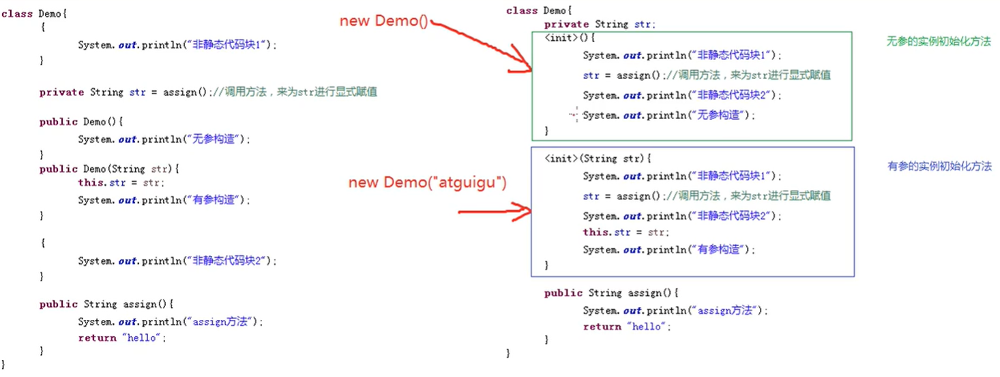

# final

final，修饰符的一种

- 可以修饰类（外部类、内部类），变量（成员变量（类变量，实例变量）、局部变量）、方法（静态方法、非静态方法）
- 修饰后有什么不同？
  - 修饰类，表示这个类不能被继承了，没有子类，可以称之为“太监类”，例如String、System、Math
  - 修饰方法，表示这个方法不能被重写，但可以正常使用
  - 修饰变量，表示这个变量不能被修改，即我们称为“常量”
    - 常量有两种
      - 字面常量：如 “hello”,12,"a"
      - final声明的变量，final int A = 10;命名每个单词都大写，单词间用 _ 分隔开


static final+变量;  表示**全局的不允许被修改的变量**

**final不能用来修饰构造方法**


# 继承

- 特点：
  1. 一种类与类之间的关系
  2. 使用已存在的类的定义作为基础建立新类
  3. 新类的定义可以增加新的数据或新的功能，也可以用父类的功能，**但不能选择性地继承父类**
  4. 父类**无法访问**子类中的**特有**成员
  5. 父类的构造方法无法被继承

# 重写

重载（在同一个类中）

1. 方法名相同，参数列表不同（参数顺序，个数，类型之中任何一个不同）
2. 返回值，访问修饰符不做限制

重写（在有继承关系的子类中）

- 语法规则
  -  返回值类型
  - 方法名
  - 参数类型，顺序和个数
- 以上3点都要与父类相同
  - 返回参数的限定符的范围必须大于或者等于之前的返回值范围
  - 父类的构造方法不允许被重写

- 改的就是父类方法的逻辑
- 父类的属性(变量)也可以重写

- 子类默认调用父类的无参构造
  

# static

一种修饰符

可以修饰

1. 方法
2. [成员变量](#局部变量和成员变量)
3. 内部类（不能修饰外部类）
4. 代码块

修饰后有什么不同

- 静态方法（或类方法），修饰后可以用“**类名.方法**”进行调用，当然也可以用“对象.方法”进行调用，不能使用本类中的非静态方法，变量，this,super因为都还没有初始化
- [成员变量](#局部变量和成员变量)，称为“类变量，静态变量”
  - 用static修饰时表示这个类型是所有对象**共享的**
  - 存储在方法区
  - get/set也是静态的
  - 如果在方法区中有局部变量与static修饰的成员变量同名时，在静态变量前加“类名.”进行区分
- [静态代码块](#类的初始化)
  - 每个类的静态代码块只会执行一次
  - 静态代码块在第一次使用这个类**之前**执行，即在类初始化时执行


# 局部变量和成员变量

相同点
      1.遵循变量的声明格式：数据类型 变量名 = 初始化值
      2.都有作用域

局部变量和成员变量的不同：

  1、定义的位置不一样

      局部变量：定义在方法内部
    
      成员变量：在方法外部，直接写在类中

  2、作用范围不一样

      局部变量：只有方法中能使用，除了方法就不能用
    
      成员变量：整个类都可以用

  3、默认值不一样

      局部变量：无默认值，先赋值在使用
    
      成员变量：如果没有赋值有默认值

  4、内存的位置不一样

      局部变量：位于栈内存
    
      成员变量：为于堆内存

  5、生命周期不一样

      局部变量：随着方法的进栈而诞生，随着方法出栈而消失
    
      成员变量：随着对象的创建而诞生，随着对象被垃圾回收而消失

# 类的初始化

执行类的初始化方法<clinit>()

类初始化方法，一个类只有一个，也是编译器生成的，由两部分组成

1. 静态变量的显示赋值代码
2. 静态代码块的代码

1，2是按照顺序执行的


# 实例初始化

非静态代码块什么时候执行？

- 在**每次**创建对象的时候执行
- 比构造器早

```java
public class NStaticTest {
    public static void main(String[] args) {
        TestBlock testBlock = new TestBlock();
        TestBlock testBlock1 = new TestBlock("ddd");
    }
}

class TestBlock {
    private String str;
    TestBlock() {
        System.out.println("无参构造器");
    }
    {
        System.out.println("非静态代码块");
    }
    public TestBlock(String str) {
        this.str = str;
        System.out.println("有参构造");
    }
}
```

执行结果：

非静态代码块
无参构造器
非静态代码块
有参构造

实例初始化过程，创建对象时，为对象进行初始化的操作

1. 为成员变量**显式**赋值
2. 执行非静态代码块
3. 执行构造器

1和2按先后顺序执行，**3 一定是最后执行的**

```java
public class NStaticTest {
    public static void main(String[] args) {
        TestBlock testBlock = new TestBlock();
        TestBlock testBlock1 = new TestBlock("ddd");
    }
}

class TestBlock {
    private String str=str();
    TestBlock() {
        System.out.println("无参构造器");
    }
    {
        System.out.println("非静态代码块");
    }
    public TestBlock(String str) {
        this.str = str;
        System.out.println("有参构造");
    }

    public String str() {
        System.out.println("str方法");
        return "dd";
    }
}
```

执行结果

str方法
非静态代码块
无参构造器
str方法
非静态代码块
有参构造

Java编译器其实会把三个部分的代码，合成一个叫做<init>(形参列表)实例初始化方法

即编译后的.class字节码信息中，没有构造器的概念


有几个构造器就有几个实例初始化方法。那么当你创建对象的时候，调用对应的构造器时，其实执行的是对应的实例初始化方法<init>(.....)




# this

用法

1. this.属性:当局部变量与成员变量同名时，可以再成员变量前面加this
2. this.方法：没有非用不可的时候
3. this()或this(实参列表)：this()表示调用本类的无参构造 ，this(实参列表)表示调用本类的有参构造

**this()或this(实参列表)必须在构造器的首行**

