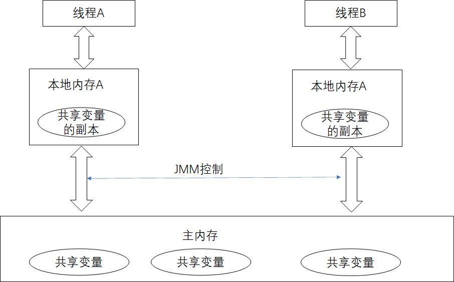

# JUC多线程及高并发

## 请谈谈对volatile的理解

### 1.volatile是Java虚拟机提供的轻量级的同步机制

- 保证可见性
- 不保证原子性
- 禁止指令重排

### JMM

JMM(Java的内存模型Java Memory Model)本省是一种抽象的概念**并不真实存在**，它描述的是一组**规则或规范**，通过这组规范定义了程序中的各个变量（包括实例字段，静态字段和构成数组对象的元素）的访问方式。

1. 可见性
2. 原子性
3. 有序性

```java
//可见性：各个线程对主内存中共享变量的操作都是各个线程各自拷贝到自己的工作内存进行操作后再写回到主内存中的
//这就可能存在一个线程A修改了共享变量x但还未写到主内存中，另外一个线程B又对主内存中同一个共享变量x进行操作，但此时
//A线程工作内存中的共享变量x对线程B来说并不可见，这种工作内存与主内存同步延迟的现象造成了可见性问题


class MyData{
    volatile int num = 0;
    public  void addTo60() {
        this.num = 60;
    }
}

/**
 * 1,验证volatile的可见性
 *    假如int num = 0,num前没有volatile修饰,没有可见性
 */
public class VolatileDemo {
    public static void main(String[] args) {
        MyData myData = new MyData();
        new Thread(() ->{
            System.out.println(Thread.currentThread().getName() + "\t come in");
            //暂停一会
            try {
                TimeUnit.SECONDS.sleep(3);
            } catch (InterruptedException e) {
                e.printStackTrace();
            }
            myData.addTo60();
            System.out.println(Thread.currentThread().getName() + "\t update number \t" + myData.num);
        },"AAA").start();

        //第二个线程main
        while (myData.num == 0){

        }
        System.out.println(Thread.currentThread().getName() + "\t over");
    }
```


```java
//原子性

class MyData{
    volatile int num = 0;
    public  void addTo60() {
        this.num = 60;
    }
    public synchronized void addPlusPlus() {num++;}
}

/**
 * 1,验证volatile的可见性
 *    假如int num = 0,num前没有volatile修饰,没有可见性
 *    添加volatile可以解决可见性问题
 * 2，验证volatile不保证原子性
 *      原子性就是不可分割，完整性，即某个线程在做某个具体业务时，中间不可以被分割，需要完整
 *      要么同时成功，要么同时失败
 */
public class VolatileDemo {
    public static void main(String[] args) {
        //seeOkByVolatile();
        MyData myData = new MyData();
        for (int i = 0; i < 20; i++) {
            new Thread(() -> {
                for (int j = 0; j < 1000; j++) {
                    myData.addPlusPlus();
                }
            },String.valueOf(i)).start();
        }
        //yield,暂停当前线程，让出本次的cpu资源，加入下一次cpu的抢夺中
        //active count返回当前活跃的线程数，至少有main和GC
        while (Thread.activeCount() > 2 ) {
            Thread.yield();//当线程数大于2时继续执行，直到剩余线程只有2个
        }
        //直到循环完了，mian线程才下的来
        System.out.println(Thread.currentThread().getName() + "\t final value : " + myData.num);
    }
}
```


**JMM**关于同步的规定：

1. 线程解锁前，必须把共享变量的值刷新回主内存
2. 线程加锁前，必须读取主内存的最新值到自己的工作内存
3. 加锁解锁的是同一把锁

由于JVM运行程序的实体是线程，而每个线程创建时JVM都会为其创建一个工作内存（有些地方称为栈空间），工作内存是每个线程的私有数据区域，而Java内存模型中规定所有变量都存储在主内存，主内存是共享内存区域，所有线程都可以访问，但线程对变量的操作（读取赋值等）必须在工作内存中进行，首先要将变量从主内存拷贝到自己的工作空间，然后对变量进行操作，操作完成后再将变量写回主内存，不能直接操作主内存中的变量，各个线程中的工作内存中存储着主内存中的**变量副本拷贝**，因此不同的线程间无法访问对方的工作内存，线程间的通信（传值）必须通过主内存来完成，其简要访问过程如下图：



## CAS你知道吗

## 原子类Atomic Integer的ABA问题谈谈，原子更新引用知道吗

### 子主题 1

## ArrayList线程不安全，请编写一个不安全的案例并给出解决方案

