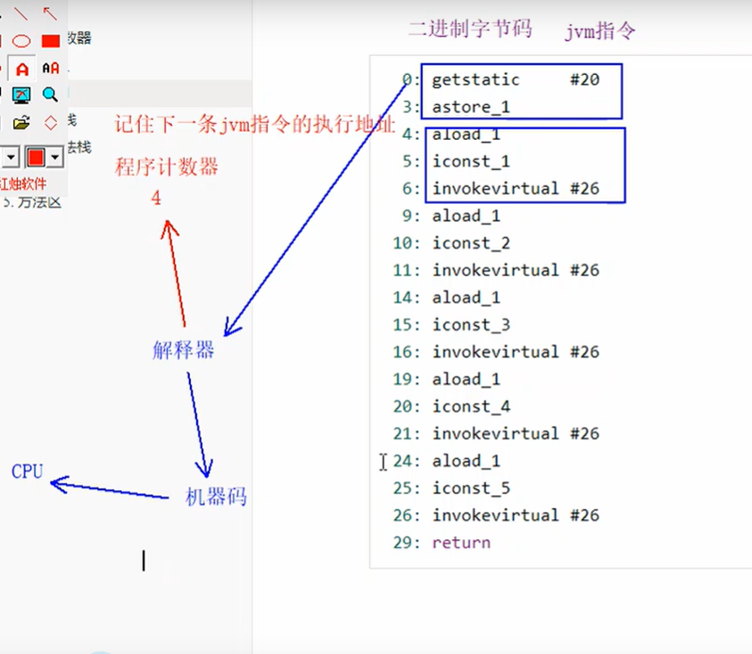
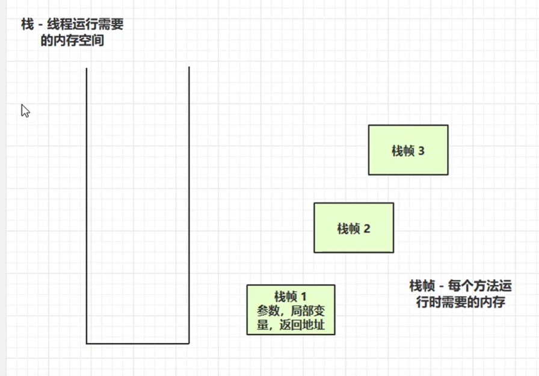

# 程序计数器(寄存器) Program Counter Register

1. 线程私有,每条线程都需要有一个独立的程序计数器，各线程之间计数器互不影响，独立存储
2. **从上面的介绍中我们知道程序计数器主要有两个作用：**(记住下一条jvm指令的执行地址)
   - 字节码解释器通过改变程序计数器来依次读取指令，从而实现代码的流程控制，如：顺序执行、选择、循环、异常处理。
   - 在多线程的情况下，程序计数器用于记录当前线程执行的位置，从而当线程被切换回来的时候能够知道该线程上次运行到哪儿了。
3. 是唯一一个不会出现内存溢出（outOfMemoryError）的内存区域，它的生命周期随着线程的创建而创建，随着线程的结束而死亡




# Java虚拟机栈（Java Virtual Machine Stacks）

先进后出

- 每个线程运行时所需要的内存，称为虚拟机栈
- 每个栈由多个栈帧（Frame）组成，对应着每次方法调用时所占用的内存
- 每个线程只能有一个活动栈帧，对应着当前正在执行的那个方法

定义：描述 方法执行的内存模型

- 方法在执行的同时，会在虚拟机栈中创建一个栈帧
- 栈帧中包含：方法的局部变量表，操作数据栈、动态链接、方法出口信息等

当方法太多时，就可能发生 栈溢出异常StackOverflowError，或者内存溢出异常OutOfMemoryError

```java
public static void main(String[] args) {
    main(new String[]{"abc","abc"});
}
```




问题辨析

1.垃圾回收是否涉及内存

答：不会涉及，栈帧内存会在每次方法执行完成后弹出栈，也就是会自动的回收掉，垃圾回收主要去堆内存回收无用的对象

2.栈内存越大越好吗

答：不对，栈内存过大会使得线程数量减少，因为物理内存大小是一定的，每个栈的内存过大会使得同时运行的线程数变小，只能说能够进行更多次的递归调用

方法内的局部变量是否线程安全

答：看线程安全与否，主要看是多个线程共享的还是说各个线程私有的

- 如果方法内局部变量没有逃离方法的作用范围，它是线程安全的
- 如果是局部变量引用了对象，并逃离方法的作用范围，需要考虑线程安全

```java
package cn.itcast.jvm.t1.stack;

/**
 * 局部变量的线程安全问题
 */
public class Demo1_17 {
    public static void main(String[] args) {
        StringBuilder sb = new StringBuilder();
        sb.append(4);
        sb.append(5);
        sb.append(6);
        new Thread(()->{
            m2(sb);
        }).start();
    }

    public static void m1() {//线程安全，其他线程不可能干扰
        StringBuilder sb = new StringBuilder();
        sb.append(1);
        sb.append(2);
        sb.append(3);
        System.out.println(sb.toString());
    }

    public static void m2(StringBuilder sb) {//线程不安全，main线程可通过参数传递修改线程
        sb.append(1);
        sb.append(2);
        sb.append(3);
        System.out.println(sb.toString());
    }

    public static StringBuilder m3() {//线程不安全，变量作为值返回有可能被别的线程修改
        StringBuilder sb = new StringBuilder();
        sb.append(1);
        sb.append(2);
        sb.append(3);
        return sb;
    }
}

```

##  栈内存溢出

1. 栈帧过多导致溢出(递归调用)

   ```java
   //栈内存溢出java.lang.StackOverflowError
   //-Xss256k设置栈内存大小，Throwable是Error和Exception的父类，用来定义所有可以作为异常被抛出来的类。
   //error，一般指严重错误，一般合理的应用程序不应该试图去捕获它，如果出现这个问题要么升级程序，要么需要升级架构，要么升   //级硬件。例如（堆内存溢出OutOfMemorError,栈内存溢出StackOverflow）
   public class demo {
       private static int count;
       public static void main(String[] args) {
           try {
               method1();
           }catch (Throwable e) {
               e.printStackTrace();
               System.out.println(count);
           }
       }
   
       private static void method1() {
           count++;
           method1();
       }
   
   }
   ```

   ```java
   看不懂
   
   import com.fasterxml.jackson.annotation.JsonIgnore;
   import com.fasterxml.jackson.core.JsonProcessingException;
   import com.fasterxml.jackson.databind.ObjectMapper;
   
   import java.util.Arrays;
   import java.util.List;
   
   /**
    * json 数据转换
    */
   public class Demo1_19 {
   
       public static void main(String[] args) throws JsonProcessingException {
           Dept d = new Dept();
           d.setName("Market");
   
           Emp e1 = new Emp();
           e1.setName("zhang");
           e1.setDept(d);
   
           Emp e2 = new Emp();
           e2.setName("li");
           e2.setDept(d);
   
           d.setEmps(Arrays.asList(e1, e2));
   
           // { name: 'Market', emps: [{ name:'zhang', dept:{ name:'', emps: [ {}]} },] }
           ObjectMapper mapper = new ObjectMapper();
           System.out.println(mapper.writeValueAsString(d));
       }
   }
   
   class Emp {
       private String name;
       @JsonIgnore
       private Dept dept;
   
       public String getName() {
           return name;
       }
   
       public void setName(String name) {
           this.name = name;
       }
   
       public Dept getDept() {
           return dept;
       }
   
       public void setDept(Dept dept) {
           this.dept = dept;
       }
   }
   class Dept {
       private String name;
       private List<Emp> emps;
   
       public String getName() {
           return name;
       }
   
       public void setName(String name) {
           this.name = name;
       }
   
       public List<Emp> getEmps() {
           return emps;
       }
   
       public void setEmps(List<Emp> emps) {
           this.emps = emps;
       }
   }
   
   ```

   

2. 栈帧过大导致溢出