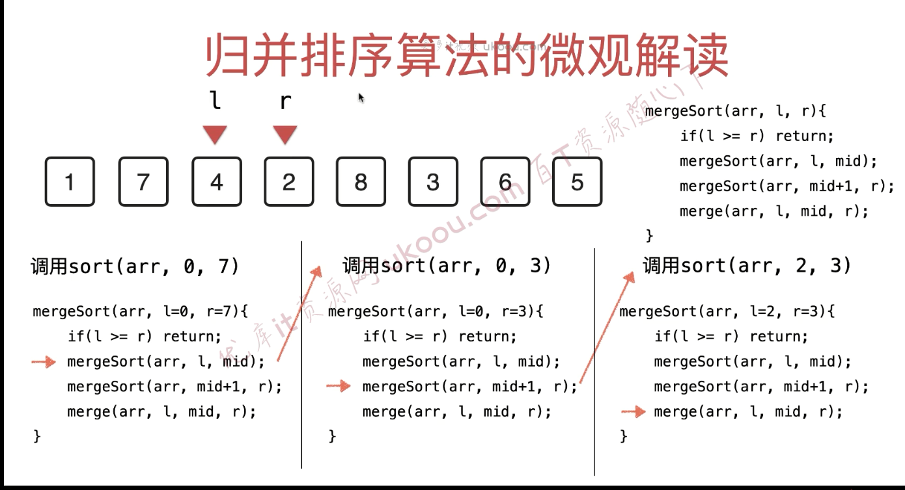
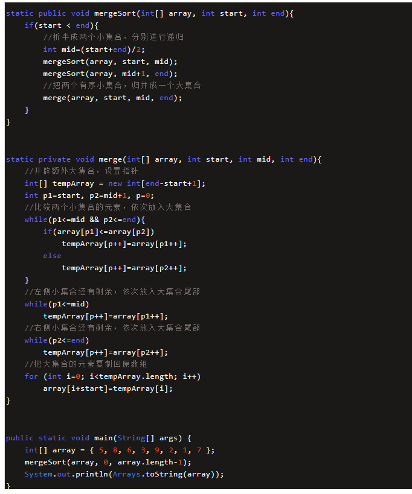
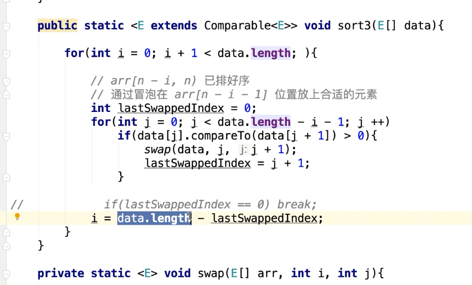
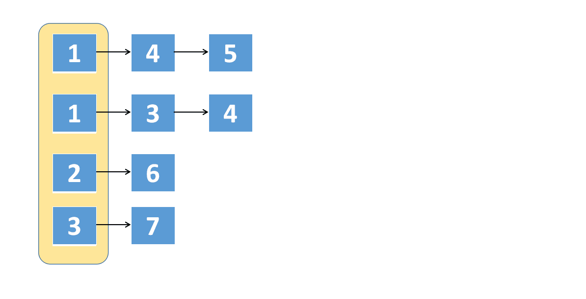
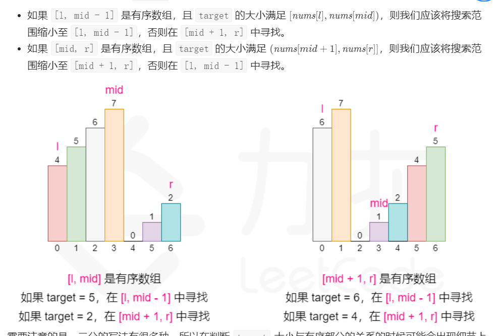

# 算法

## 用数组实现栈

~~~java
public class MyStack {
   private int maxSize;
   private long[] stackArray;
   private int top;
   public MyStack(int s) {
      maxSize = s;
      stackArray = new long[maxSize];
      top = -1;
   }
   public void push(long j) {
      stackArray[++top] = j;
   }
   public long pop() {
      return stackArray[top--];
   }
   public long peek() {
      return stackArray[top];
   }
   public boolean isEmpty() {
      return (top == -1);
   }
   public boolean isFull() {
      return (top == maxSize - 1);
   }
   public static void main(String[] args) {
      MyStack theStack = new MyStack(10); 
      theStack.push(10);
      theStack.push(20);
      theStack.push(30);
      theStack.push(40);
      theStack.push(50);
      while (!theStack.isEmpty()) {
         long value = theStack.pop();
         System.out.print(value);
         System.out.print(" ");
      }
      System.out.println("");
   }
}
~~~

~~~java

public class Stack {
	private int top = -1;
	private Object[] objs;
	
	public Stack(int capacity) throws Exception{
		if(capacity < 0)
			throw new Exception("Illegal capacity:"+capacity);
		objs = new Object[capacity];
	}
	
	public void push(Object obj) throws Exception{
		if(top == objs.length - 1)
			throw new Exception("Stack is full!");
		objs[++top] = obj;
	}
	
	public Object pop() throws Exception{
		if(top == -1)
			throw new Exception("Stack is empty!");
		return objs[top--];
	}
	
	public void dispaly(){
		System.out.print("bottom -> top: | ");
		for(int i = 0 ; i <= top ; i++){
			System.out.print(objs[i]+" | ");
		}
		System.out.print("\n");
	}
	
	public static void main(String[] args) throws Exception{
		Stack s = new Stack(2);
		s.push(1);
		s.push(2);
		s.dispaly();
		System.out.println(s.pop());
		s.dispaly();
		s.push(99);
		s.dispaly();
		s.push(99);
	}

————————————————
版权声明：本文为CSDN博主「sean-zou」的原创文章，遵循CC 4.0 BY-SA版权协议，转载请附上原文出处链接及本声明。
原文链接：https://blog.csdn.net/a19881029/article/details/22579759
~~~

动态数组实现

~~~java
import java.util.Arrays;
 
public class UnboundedStack {
	private int top = -1;
	private Object[] objs;
	
	public UnboundedStack() throws Exception{
		this(10);
	}
	
	public UnboundedStack(int capacity) throws Exception{
		if(capacity < 0)
			throw new Exception("Illegal capacity:"+capacity);
		objs = new Object[capacity];
	}
	
	public void push(Object obj){
		if(top == objs.length - 1){
			this.enlarge();
		}
		objs[++top] = obj;
	}
	
	public Object pop() throws Exception{
		if(top == -1)
			throw new Exception("Stack is empty!");
		return objs[top--];
	}
	
	private void enlarge(){
		int num = objs.length/3;
		if(num == 0)
			num = 1;
		objs = Arrays.copyOf(objs, objs.length + num);
	}
	
	public void dispaly(){
		System.out.print("bottom -> top: | ");
		for(int i = 0 ; i <= top ; i++){
			System.out.print(objs[i]+" | ");
		}
		System.out.print("\n");
	}
	
	public static void main(String[] args) throws Exception{
		UnboundedStack us = new UnboundedStack(2);
		us.push(1);
		us.push(2);
		us.dispaly();
		System.out.println(us.pop());
		us.dispaly();
		us.push(99);
		us.dispaly();
		us.push(99);
		us.dispaly();
	}

————————————————
版权声明：本文为CSDN博主「sean-zou」的原创文章，遵循CC 4.0 BY-SA版权协议，转载请附上原文出处链接及本声明。
原文链接：https://blog.csdn.net/a19881029/article/details/22579759
~~~

## 数组实现队列

~~~java
package com.bobo.algorithm;

public class ArraysToLoopQueue<E> {
    private E[] data;
    //tail下一次要入队应该存储的位置,front队首存放元素的位置
    private int front,tail;
    private int size;

    public ArraysToLoopQueue(int capacity) {
        data = (E[]) new Object[capacity + 1];
        front = 0;
        tail = 0 ;
        size = 0;

    }
    public ArraysToLoopQueue() {
        this(10);
    }

    public int getCapacity() {
        return data.length - 1;
    }

    public boolean isEmpty() {
        return front == tail;
    }

    public int getSize() {
        return size;
    }

    public void enqueue(E e) {
        if((tail + 1) % data.length == front) {
            resize(getCapacity() * 2);
        }
        data[tail] = e;
        tail = (tail + 1) % data.length;//想象tail在尾部时
        size++;

    }

    public E dequeue() {
        if(isEmpty()) {
            throw new IllegalArgumentException("不能从空队列中出队");
        }
        E ret = data[front];
        data[front] = null;
        size--;
        front = (front + 1) % data.length;//想象在尾部
        if(size == getCapacity() / 4 && getCapacity() / 2 != 0) {
            resize(getCapacity() / 2);
        }
        return ret;

    }
    public E getFront() {
        if(isEmpty()) {
            throw new IllegalArgumentException("空队列");

        }
        return data[front];
    }

    private void resize(int newCapacity) {
        E[] newData = (E[]) new Object[newCapacity + 1];
        for (int i = 0; i < size; i++) {
            newData[i] = data[(i + front) % data.length];

        }
        data = newData;
        front = 0;
        tail = size;
    }

    @Override
    public String toString() {

        StringBuilder sb = new StringBuilder();
        sb.append(String.format("Queue: size = %d , capacity = %d\n", size, getCapacity()));
        sb.append("front [");
        for (int i = 0; i < size; i++) {
            sb.append(data[(i + front) % data.length]);
            if(((i + front) % data.length) != tail-1){
                sb.append(",");
            }

        }
        sb.append("] tail");
        return sb.toString();
    }

    public static void main(String[] args) {
        ArraysToLoopQueue<Integer> queue = new ArraysToLoopQueue<>();
        for (int i = 0; i < 10; i++) {
            queue.enqueue(i);
            System.out.println(queue);
            if(i % 3 == 2) {
                queue.dequeue();
                System.out.println(queue);
            }
        }

        System.out.println(10/4);
    }

}

~~~

## 归并排序

[例一](https://www.cnblogs.com/chengxiao/p/6194356.html)

~~~java
package sortdemo;

import java.util.Arrays;

/**
 * Created by chengxiao on 2016/12/8.
 */
public class MergeSort {
    public static void main(String []args){
        int []arr = {9,8,7,6,5,4,3,2,1};
        sort(arr);
        System.out.println(Arrays.toString(arr));
    }
    public static void sort(int []arr){
        int []temp = new int[arr.length];//在排序前，先建好一个长度等于原数组长度的临时数组，避免递归中频繁开辟空间
        sort(arr,0,arr.length-1,temp);
    }
    private static void sort(int[] arr,int left,int right,int []temp){
        if(left<right){
            int mid = (left+right)/2;
            sort(arr,left,mid,temp);//左边归并排序，使得左子序列有序
            sort(arr,mid+1,right,temp);//右边归并排序，使得右子序列有序
            merge(arr,left,mid,right,temp);//将两个有序子数组合并操作
        }
    }
    private static void merge(int[] arr,int left,int mid,int right,int[] temp){
        int i = left;//左序列指针
        int j = mid+1;//右序列指针
        int t = 0;//临时数组指针
        while (i<=mid && j<=right){
            if(arr[i]<=arr[j]){
                temp[t++] = arr[i++];
            }else {
                temp[t++] = arr[j++];
            }
        }
        while(i<=mid){//将左边剩余元素填充进temp中
            temp[t++] = arr[i++];
        }
        while(j<=right){//将右序列剩余元素填充进temp中
            temp[t++] = arr[j++];
        }
        t = 0;
        //将temp中的元素全部拷贝到原数组中
        while(left <= right){
            arr[left++] = temp[t++];
        }
    }
}
~~~

[例二](https://mp.weixin.qq.com/s/885uGVhlffWAxjgIEW-TiA)

综合版

~~~java
public class MergeSort {
    public static void main(String[] args) {
        int []arr = {9,8,7,6,5,4,3,2,1,0};
        mergeSort(arr,0,arr.length -1);
        System.out.println(Arrays.toString(arr));
    }

    public static void mergeSort(int[] arr,int start,int end) {
        if (start < end) {
            int mid = (start + end)/2;
            mergeSort(arr,start,mid);
            mergeSort(arr,mid+1,end);
            merge(arr,start,mid,end);
        }
    }

    private static void merge(int[] arr,int left,int mid,int right) {
        //在排序前，先建好一个长度等于原数组长度的临时数组，避免递归中频繁开辟空间
        int[] temp = new int[arr.length];
        int i = left;//左序列指针
        int j = mid + 1;//右序列指针
        int t = 0;//临时数组指针

        while (i <= mid && j <= right) {//一定要有=才能完全遍历
            if (arr[i] <= arr[j]) {
                temp[t++] = arr[i++];
            }else {
                temp[t++] = arr[j++];
            }
        }

        while (i <= mid) {//将左边剩余元素放进temp中
            temp[t++] = arr[i++];
        }

        while (j <= right) {//将左边剩余元素放进temp中
            temp[t++] = arr[j++];
        }
        //t重置为0，使得其从头开始复制元素
        t = 0;
        while (left <= right) {
            arr[left++] = temp[t++];
        }

    }

}
~~~

## 冒泡排序

[例一](https://www.cnblogs.com/chengxiao/p/6103002.html)

~~~java
 public static void bubbleSort(int[] arr) {
        for (int i = 0; i < arr.length - 1; i++) {
            boolean flag = true;//设定一个标记，若为true，则表示此次循环没有进行交换，也就是待排序列已经有序，排序已然完成。
            for (int j = 0; j < arr.length - 1 - i; j++) {
                if (arr[j] > arr[j + 1]) {
                    swap(arr,j,j+1);
                    flag = false;
                }
            }
            if (flag) {
                break;
            }
        }
    }

 private static void swap(int[] arr,int i,int j) {//数组的交换很重要
        arr[i] = arr[i] + arr[j];
        arr[j] = arr[i] - arr[j];
        arr[i] = arr[i] - arr[j];

    }
~~~

例二

## 快排

[例一](https://www.cnblogs.com/chengxiao/p/6262208.html)

[非常好](https://blog.csdn.net/nrsc272420199/article/details/82587933)

~~~java
public class QuickSort {
	public static void main(String[] args) {
		int[] arr = { 49, 38, 65, 97, 23, 22, 76, 1, 5, 8, 2, 0, -1, 22 };
		quickSort(arr, 0, arr.length - 1);
		System.out.println("排序后:");
		for (int i : arr) {
			System.out.println(i);
		}
	}

	private static void quickSort(int[] arr, int low, int high) {
		//只是一个if判断，只需保证传入的low和high的值保持对应的大小关系
		if (low < high) {
			// 找寻基准数据的正确索引
			int index = getIndex(arr, low, high);

			// 进行迭代对index之前和之后的数组进行相同的操作使整个数组变成有序
			//quickSort(arr, 0, index - 1); 之前的版本，这种姿势有很大的性能问题，谢谢大家的建议
			quickSort(arr, low, index - 1);
			quickSort(arr, index + 1, high);
		}

	}
	//将在low的数字放到正确的位置，并返回其索引
	private static int getIndex(int[] arr, int low, int high) {
		// 基准数据
		int tmp = arr[low];
		while (low < high) {
            //一定是while,直到arr[high] < temp才能进行下一步
            //low < high也要判断，避免极端情况，一开始就是排好序的
			// 当队尾的元素大于等于基准数据时,向前挪动high指针
			while (low < high && arr[high] >= tmp) {
				high--;
			}
			// 如果队尾元素小于tmp了,需要将其赋值给low
			arr[low] = arr[high];
			// 当队首元素小于等于tmp时,向前挪动low指针
			while (low < high && arr[low] <= tmp) {
				low++;
			}
			// 当队首元素大于tmp时,需要将其赋值给high
			arr[high] = arr[low];

		}
		// 跳出循环时low和high相等,此时的low或high就是tmp的正确索引位置
		// 由原理部分可以很清楚的知道low位置的值并不是tmp,所以需要将tmp赋值给arr[low]
		arr[low] = tmp;
		return low; // 返回tmp的正确位置
	}
}

~~~

## 反转链表

[拉布拉多](https://labuladong.gitee.io/algo/%E6%95%B0%E6%8D%AE%E7%BB%93%E6%9E%84%E7%B3%BB%E5%88%97/%E9%80%92%E5%BD%92%E5%8F%8D%E8%BD%AC%E9%93%BE%E8%A1%A8%E7%9A%84%E4%B8%80%E9%83%A8%E5%88%86.html)

~~~java
class Solution {
    public ListNode reverseList(ListNode head) {
        if(head==null || head.next==null) return head;
        ListNode last = reverseList(head.next);
        head.next.next=head;
        head.next=null;
        return last;
    }
}
~~~

~~~java
class Solution {
    public ListNode reverseList(ListNode head) {
        ListNode pre = null;
        ListNode cur = head;
        while(true){
            if(cur ==null){break;}
            ListNode temp = cur.next;//把next的地址复制给temp
            cur.next = pre;//把pre的地址复制给cur.next
            pre = cur;//把cur的地址复制给pre
            cur = temp;//把temp的地址复制给cur
        }
        return pre;
    }
}
~~~

## 92. 反转链表 II

~~~java
class Solution {
    public ListNode reverseBetween(ListNode head, int left, int right) {
        if(left == 1){
            return reverseN(head,right);
        }
        ListNode last = reverseBetween(head.next,left-1,right-1);
        head.next = last;
        return head;
    }
    ListNode successor = null;//一定是在函数外面
    public ListNode reverseN(ListNode head,int n) {
        
        if(n ==1) {
            successor = head.next;
            return head;
        }
        ListNode last = reverseN(head.next,n-1);
        head.next.next = head;
        head.next = successor;
        return last;
    }

}
~~~

## LRU

~~~java
class LRUCache {
    private Map<Integer,Node> map;
    private DoubleList cache;
    private int capacity;

    public LRUCache(int capacity) {
        this.capacity = capacity;
        map = new HashMap<>();
        cache = new DoubleList();
    }
    
    public int get(int key) {
        if(!map.containsKey(key)){
            return -1;
        }
        int val = map.get(key).value;
        put(key,val);
        return val;
    }
    
    public void put(int key, int value) {
        Node n = new Node(key,value);
        if(map.containsKey(key)){
            cache.addFirst(n);
            cache.remove(map.get(key));
            
            map.put(key,n);
        }else{
            if(cache.size() == capacity){
                Node last = cache.removeLast();
                map.remove(last.key);
            }
            cache.addFirst(n);
            map.put(key,n);
        }
    }
    private class Node{
        Node pre,next;
        int key,value;

        private Node(int k,int v){
            this.key = k;
            this.value = v;
        }
    }
    private class DoubleList{
        Node head = new Node(0,0);
        Node tail = new Node(0,0);
        int size;

        private DoubleList(){
            head.next = tail;
            tail.pre = head;
            size =0;
        }

        private void addFirst(Node n){
            Node headNext = head.next;//一定要提出来，我也不知道为什么
            n.next = headNext;
            n.pre = head;
            head.next = n;//此处head.next指向了n，所以head.next.pre = n是错误的
            headNext.pre = n;
            size++;
        }
        //正确写法
         private void addFirst(Node n){         
            n.next = head.next;
            n.pre = head;
            head.next.pre = n;
            head.next = n;           
            size++;
        }
        
        

        private void remove(Node n){
            n.pre.next = n.next;
            n.next.pre = n.pre;            
            size--;
        }

        private Node removeLast(){
            Node last = tail.pre;
            remove(last);
            return last;
        }

        private int size() {
            return size;
        }
    }
}

~~~

## 215.数组中的第K个最大元素

~~~java
int findKthLargest(int[] nums, int k) {
    // 小顶堆，堆顶是最小元素
    PriorityQueue<Integer> 
        pq = new PriorityQueue<>();//默认是小堆顶
    for (int e : nums) {
        // 每个元素都要过一遍二叉堆
        pq.offer(e);
        // 堆中元素多于 k 个时，删除堆顶元素
        if (pq.size() > k) {
            pq.poll();
        }
    }
    // pq 中剩下的是 nums 中 k 个最大元素，
    // 堆顶是最小的那个，即第 k 个最大元素
    return pq.peek();
}
~~~

~~~java
class Solution {
    public int findKthLargest(int[] nums, int k) {
        k = nums.length - k;
        int lo = 0,hi = nums.length - 1;
        while(true){
            if(lo > hi){break;}
            int p = partition(nums,lo,hi);
            if(p < k){
                lo = p +1;
            }else if(p > k) {
                hi = p -1;
            }else{
                return nums[p];
            }
        }
        return -1;
    }

    public int partition(int[] arr,int low,int high) {
        int temp = arr[low];
        while(true){
            if(low == high){break;}
            while(low < high && arr[high] >= temp) {//low < high 要加上
                high--;
            }
            arr[low] = arr[high];
            while(low < high && arr[low]<=temp) {
                low++;
            }
            arr[high] = arr[low];
        }
        arr[low] = temp;
        return low;
    }
}
~~~

## 堆排序

[连接](https://blog.csdn.net/u010452388/article/details/81283998)

~~~java
public class HeapSort {

    //堆排序
    public static void heapSort(int[] arr) {
        //构造大根堆
        heapInsert(arr);
        int size = arr.length;
        while (size > 1) {
            //固定最大值
            swap(arr,0,size - 1);
            size--;
            heapify(arr,0,size);
        }
    }

    //构造大根堆
    public static void heapInsert(int[] arr) {
        for (int i = 0; i < arr.length; i++) {
            //当前插入的索引
            int currentIndex = i;
            //父节点的索引
            int parentIndex = (currentIndex - 1) / 2;
            //如果当前插入的值大于其父节点的值，则交换值，并且将索引指向父节点，
            //然后继续和上面的父节点比较，直到不大于父节点，退出循环
            while (arr[currentIndex] > arr[parentIndex]) {
                swap(arr,currentIndex,parentIndex);
                //将父索引赋予当前索引，以便继续往上查找
                currentIndex = parentIndex;
                //重新计算相对于当前索引的父索引
                parentIndex = (currentIndex - 1)/2;
            }
        }
    }
    //将剩余的数构成大根堆(从顶端开始)
    public static void heapify(int[] arr,int parent,int size) {
        int left = 2 * parent + 1;
        int right = 2 * parent + 2;
        
        while (left < size) {
            int largestIndex = 0;
            //判断孩子中较大的值的索引（要确保右孩子在size范围内）
            if (arr[left] < arr[right] && right < size) {
                largestIndex = right;
            }else {
                largestIndex = left;
            }
            //比较父节点的值大于孩子中较大的值，建堆完成，直接退出
            if (arr[parent] > arr[largestIndex]) {
                break;
            }
            //父节点不是最大值，与孩子中较大的值交换
            swap(arr,largestIndex,parent);
            //将索引指向较大值，因为是和较大值进行的交换，所以要保证交换后
            //较大值这里的二叉堆成立
            parent = largestIndex;
            //重新计算交换后孩子的索引
            left = 2 * parent + 1;
            right = 2 * parent + 2;

        }
    }

    public static void swap(int[] arr,int i,int j) {
        int temp = arr[i];
        arr[i] = arr[j];
        arr[j] = temp;
    }

    public static void main(String[] args) {
        int []arr = {9,8,7,6,4,3,2,5,1,0};
        heapSort(arr);
        System.out.println(Arrays.toString(arr));
    }
}
~~~

## 二分搜索

~~~java
//leetcode 704
//玩转算法面试
public class BinarySearch {
    public int search(int[] nums, int target) {
        int l = 0;
        int r = nums.length - 1;//在[l...r]范围寻找target
        while (l <= r){//当l == r时，[l...r]依然是有效的
            int mid = (l + r) / 2;
            if (nums[mid] == target) {
                return mid;
            }
            if (target > nums[mid]) {
                l = mid + 1;//target在[mid+1...r]中
            }else {
                r = mid - 1;//target在[l...mid-1]中
            }
        }

        return -1;
    }
}
~~~

## 1.两数之和

~~~java
//LeetCode 1
class Solution {
    public int[] twoSum(int[] nums, int target) {
        Map<Integer,Integer> map = new HashMap<>();
        for(int i = 0;i < nums.length;i++) {
            if(map.containsKey(target - nums[i])){
                return new int[]{map.get(target - nums[i]),i};
            }
            map.put(nums[i],i);
        }
        return null;
    }
}

~~~

## 167. 两数之和 II - 输入有序数组

~~~java
class Solution {
    public int[] twoSum(int[] numbers, int target) {
        int left = 0,right = numbers.length-1;
        while(left < right) {
            if(numbers[left] + numbers[right] == target) {
                return new int[]{left +1,right+1};
            }else if(numbers[left] + numbers[right] < target){
                left++;
            }else {
                right--;
            }
            
        }
        return new int[]{-1,-1};
    }
}
~~~

## 环形链表

LeetCode 141

~~~java
boolean hasCycle(ListNode head) {
    ListNode fast, slow;
    fast = slow = head;
    while (fast != null && fast.next != null) {//fast要跳两步
        fast = fast.next.next;
        slow = slow.next;

        if (fast == slow) return true;
    }
    return false;
}
~~~

用while true

~~~java
boolean hasCycle(ListNode head) {
    ListNode fast, slow;
    fast = slow = head;
    while (true) {//fast要跳两步
        if (fast == null || fast.next == null) return false;
        fast = fast.next.next;
        slow = slow.next;
        if (fast == slow) return true;
    }
}
~~~

## 142.环形链表二

LeetCode 142

~~~java
public class Solution {
    public ListNode detectCycle(ListNode head) {
        ListNode fast = head, slow = head;
        while (true) {
            if (fast == null || fast.next == null) return null;
            fast = fast.next.next;
            slow = slow.next;
            if (fast == slow) break;
        }
        fast = head;
        while (slow != fast) {
            slow = slow.next;
            fast = fast.next;
        }
        return fast;
    }
}

作者：jyd
链接：https://leetcode-cn.com/problems/linked-list-cycle-ii/solution/linked-list-cycle-ii-kuai-man-zhi-zhen-shuang-zhi-/
来源：力扣（LeetCode）
著作权归作者所有。商业转载请联系作者获得授权，非商业转载请注明出处。
~~~

## 删除链表的倒数第 N 个结点

~~~java
class Solution {
    public ListNode removeNthFromEnd(ListNode head, int n) {
        ListNode dummy = new ListNode(0, head);
        ListNode first = head;
        ListNode second = dummy;
        for (int i = 0; i < n; ++i) {
            first = first.next;
        }
        while (first != null) {
            first = first.next;
            second = second.next;
        }
        second.next = second.next.next;
        ListNode ans = dummy.next;
        return ans;
    }
}

作者：LeetCode-Solution
链接：https://leetcode-cn.com/problems/remove-nth-node-from-end-of-list/solution/shan-chu-lian-biao-de-dao-shu-di-nge-jie-dian-b-61/
来源：力扣（LeetCode）
著作权归作者所有。商业转载请联系作者获得授权，非商业转载请注明出处。
~~~

## 26. 删除有序数组中的重复项

~~~java
//快慢指针
class Solution {
    public int removeDuplicates(int[] nums) {
        if (nums.length == 0) {
            return 0;
        }
        int slow = 0;
        int fast = 0;
        while(true) {
            if(fast >= nums.length){//索引是length-1
                break;
            }
            if(nums[slow] == nums[fast]){
                fast++;
            }else{
                slow++;
                nums[slow] = nums[fast];
            }
        }
        return slow+1;
    }
}
~~~

## 83. 删除排序链表中的重复元素

~~~java
//快慢指针，注意数组和链表中指针快慢的区别
class Solution {
    public ListNode deleteDuplicates(ListNode head) {
        if(head == null){return null;}
        ListNode slow = head,fast = head;
        while(true) {
            if(fast == null){break;}
            if(slow.val == fast.val) {
                fast = fast.next;
            }else{
                slow = slow.next;
                slow.val = fast.val;
            }
        }
        slow.next = null;
        return head;
    }
}
~~~

## 27. 移除元素

错误，fast无论如何都要增加

~~~java

class Solution {
    public int removeElement(int[] nums, int val) {
        int fast = 0,slow = 0;
        while(true) {
            if(fast == nums.length){break;}
            if(nums[fast] == val) {
                fast++;
            }else{
                nums[slow] = nums[fast];
                slow++;            
            }
        }
        return slow;
    }
}
~~~

正确

~~~java
int removeElement(int[] nums, int val) {
    int fast = 0, slow = 0;
    while (fast < nums.length) {
        if (nums[fast] != val) {
            nums[slow] = nums[fast];
            slow++;
        }
        fast++;
    }
    return slow;
}
~~~

## 83. 移动零

~~~java
class Solution {
    public void moveZeroes(int[] nums) {
        int slow = 0,fast = 0;
        while(true){
            if(fast == nums.length){break;}
            if(nums[fast] != 0) {            
                nums[slow] = nums[fast];//一定要先赋值再增加
                slow++;
            }
            fast++;
        }
        for(int i= slow;i <nums.length;i++) {
            nums[i] = 0;
        }
    }
}
~~~

## 75. 颜色分类

双指针

~~~java
class Solution {
    public void sortColors(int[] nums) {
        int slow = 0,fast = 0;
        for(int i =0;i<=2;i++){
            while(true){
                if(fast == nums.length){break;}
                if(nums[fast] == i) {
                    int temp = nums[slow];
                    nums[slow] = nums[fast];
                    nums[fast] = temp;
                    slow++;
                }
                fast++;
            }
            fast = slow;
        }
    }
}
~~~

## 88. 合并两个有序数组

归并排序

~~~java
class Solution {
    public void merge(int[] nums1, int m, int[] nums2, int n) {
        int[] temp = new int[m+n];
        int left =0;
        int right = 0;
        int t = 0;
        while(true){
            if(left==m || right ==n){break;}
            if(nums1[left] <= nums2[right]){
                temp[t++] = nums1[left++];
            }else{
                temp[t++] = nums2[right++];
            }
        }
        while(true){
            if(left == m){break;}
            temp[t++] = nums1[left++];
        }
         while(true){
            if(right == n){break;}
            temp[t++] = nums2[right++];
        }
        for(int i=0;i<m+n;i++) {
            nums1[i] =temp[i]; 
        }
    }
}
~~~

## 102. 二叉树的层序遍历

BFS

~~~java
class Solution {
    public List<List<Integer>> levelOrder(TreeNode root) {
        List<List<Integer>> res = new ArrayList<>();
        Queue<TreeNode> queue = new LinkedList<>();
        if(root != null){
            queue.offer(root);
        }
        while (!queue.isEmpty()){
            int n = queue.size();
            List<Integer> level = new ArrayList<>();
            for(int i = 0;i<n;i++){
                TreeNode node = queue.poll();
                level.add(node.val);
                if(node.left != null) {
                    queue.offer(node.left);
                }
                if(node.right != null) {
                    queue.offer(node.right);
                }
            }
            res.add(level);
        }
        return res;
    }
}
~~~

## 199. 二叉树的右视图

~~~java
class Solution {
    public List<Integer> rightSideView(TreeNode root) {
        Queue<TreeNode> queue = new LinkedList<>();
        if(root != null) {
            queue.offer(root);
        }
        List<Integer> list = new ArrayList<>();
        while(!queue.isEmpty()){
            int size = queue.size();
            for (int i = 0;i <size;i++){
                TreeNode node = queue.poll();
                if(i==size-1){//层序遍历的最后一个元素加入队列
                    list.add(node.val);
                }
                if(node.left !=null){
                    queue.offer(node.left);
                }
                if(node.right != null){
                    queue.offer(node.right);
                }
            }
        }
        return list;
    }
}
~~~

## 103. 二叉树的锯齿形层序遍历

~~~java
class Solution {
    public List<List<Integer>> zigzagLevelOrder(TreeNode root) {
        List<List<Integer>> res = new ArrayList<>();
        Queue<TreeNode> queue = new LinkedList<>();
        if(root!=null){
            queue.offer(root);
        }
        int count = 0;
        while(!queue.isEmpty()){
            List<Integer> level = new ArrayList<>();
            int n = queue.size();//不能直接写在for循环上，因为循环语句内会更新queue.size()
            count++;
             for(int i = 0;i <n;i++){
                  TreeNode node = queue.poll();
                  level.add(node.val);
                  if(node.left != null){
                       queue.offer(node.left); 
                  }
                  if(node.right != null){
                      queue.offer(node.right);
                  }  
             }   
              if(count % 2 ==0){
                  Collections.reverse(level);
              }
             res.add(level);
        }
        return res;
    }
}
~~~

## 接雨水

一个一个的带进去

~~~java
class Solution {
    public int trap(int[] height) {//双指针
        int n = height.length;
        int left = 0,right=n-1;
        int res = 0;
        int l_max = 0;
        int r_max = 0;
        while(left <= right) {
            l_max = Math.max(height[left],l_max);
            r_max = Math.max(height[right],r_max);
            if(l_max < r_max) {
                res += l_max - height[left];
                left++;
            }else{
                res += r_max - height[right];
                right--;
            }
        }
        return res;
    }
}
~~~

~~~java
class Solution {
    public int trap(int[] height) {
        /*
        使用两个指针，一个 left_max ，一个 right_max

        这个双指针是怎么个使用法呢？
        首先每次循环开始，先获取 left 的左边 [0, left - 1] 最高柱子高度 和 right 右边 [right + 1, len - 1] 最高柱子高度（都不包括 left 和 right 本身）
        当 left_max < right_max 时，那么就说明对于 left 右边一定有比 left_max 更高的柱子，那么只需要判断 left 左边 最高柱子 left_max 是否比 left 柱子高就行了，如果是，那么就能装水
        当 left_max >= right_max 时，那么就说明对于 right 左边一定有比 right_max 更高或者相同高度的柱子，那么只需要判断 right 右边最高柱子 right_max 是否比 right 柱子高就行了
        其实就是保证哪边稳定有高柱子就查看哪边
        
        为什么可以隔这么远进行判断？
        比如 对于 left 柱子，如果 left_max 比 left 高，那么如果 right_max 比 left_max 高，那么就跟上面说的 left 右边一定存在比 left 高的柱子，那么 left 柱能装水，
        就算 right_max 对于 left 右边来说不是最高的柱子也无所谓，因为如果不是最高的柱子，那么同样存在另一个比 left 高的柱子，那么 left 同样也能装水，且装水量同样是 left_max - left

        当 left_max < right_max 时，那么当前柱 left 装水量就是直接 left_max - height[left];
        当 left_max >= right_max 时，那么当前柱 right 装水量就是直接， right_max - height[right]
        */
        int left_max = 0;
        int right_max = 0;
        int res = 0;
        int left = 1;
        int right = height.length - 2;
        /*
        为什么需要 left == right?
        比如 [0,1,0,2,1,0,1,3,2,1,2,1]
                      1
              1       1 1   1
        0 1 0 1 1 0 1 1 1 1 1 1
                    ↑
                  right
                    ↑
                   left
        当 right_max == 3 时，那么就说明 right 已经到了 3 柱子的下一个 了，即 height[right] == 1
        这时看左边，左边已经没有比 3 更高的了，因此 left 会一直 left++，直到发现 和 right 重合，
        而这时 left_max == 2，而 right_max == 3，同时 height[left(right)] == 1，但这根柱子还没有进行判断并且是可以装水的，如果 left == right 就退出循环，那么就会漏掉这柱子的装水量
        */
        while(left <= right){
            left_max = Math.max(left_max, height[left - 1]);
            right_max = Math.max(right_max, height[right + 1]);
            if(left_max < right_max){
                if(left_max > height[left]){
                    res += left_max - height[left];
                }
                left++;
            }else{
                if(right_max > height[right]){
                    res += right_max - height[right];
                }
                right--;
            }
        }
        return res;
    }
}
~~~

## 236. 二叉树的最近公共祖先

~~~java
class Solution {
    public TreeNode lowestCommonAncestor(TreeNode root, TreeNode p, TreeNode q) {
        if(root == null || root == p || root == q) return root;
        TreeNode left = lowestCommonAncestor( root.left,p,q);
        TreeNode right = lowestCommonAncestor( root.right, p,q);

    if(right != null && left != null) return root;//p,q分别在左右子树
    if(right == null && left == null) return null;//左右子树都没有p,q
    return left ==null ? right:left;//p,q要么都在左子树，要么都在右子树
    }
}
~~~

## 20. 有效的括号

~~~java
class Solution {
    public boolean isValid(String s) {
        int length = s.length();
       
        Stack<Character> left = new Stack<>();
        for (int i = 0; i < length; i++) {
            char c = s.charAt(i);
            if (c =='(' || c =='{' || c == '['){
                left.push(c);
            }else {
                if (!left.empty()&& leftOf(c) == left.peek()) {//一定要先判断空再比较
                    left.pop();
                }else {
                    return false;
                }
            }
        }
        return left.empty();

    }
    public char leftOf(char c) {
        if (c == '}') return '{';
        if (c == ')') return '(';
        return '[';
    }
}
~~~

## 23. 合并K个升序链表

~~~java
class Solution {
    public ListNode mergeKLists(ListNode[] lists) {
        if(lists.length == 0) return null;
        PriorityQueue<ListNode> queue = new PriorityQueue<>((a,b) ->(a.val - b.val));
        ListNode head = new ListNode();
        ListNode cur = head;
        for(ListNode node : lists){
            if(node != null){
                queue.offer(node);
            }
        }
        while(!queue.isEmpty()) {
            ListNode removedNode = queue.poll();
            cur.next = removedNode;
            cur = cur.next;
            if(removedNode.next != null){
                queue.offer(removedNode.next);
            }
        }
        return head.next;
    }
}
~~~

## 415. 字符串相加

~~~java
class Solution {
    public String addStrings(String num1, String num2) {
        StringBuilder res = new StringBuilder();
        int i = num1.length() - 1,j = num2.length() -1,carry =0;
        while(i >=0 || j>=0){
            int n1 = i >=0 ? num1.charAt(i)-'0':0;
            int n2 = j >=0 ? num2.charAt(j)-'0':0;
            int temp = n1 + n2 + carry;
            carry = temp/10;
            res.append(temp % 10);
            i--;
            j--;
        }
        if(carry == 1) res.append(1);
        return res.reverse().toString();
    }
}
~~~

## 33.搜索旋转排序数组

~~~java
class Solution {
    public int search(int[] nums, int target) {
        int len = nums.length;
        if(len == 0) return -1;
        int left = 0, right = len - 1;
        // 1. 首先明白，旋转数组后，从中间划分，一定有一边是有序的。
        // 2. 由于一定有一边是有序的，所以根据有序的两个边界值来判断目标值在有序一边还是无序一边
        // 3. 这题找目标值，遇到目标值即返回
        // 4. 注意：由于有序的一边的边界值可能等于目标值，所以判断目标值是否在有序的那边时应该加个等号(在二分查找某个具体值得时候如果把握不好边界值，可以再每次查找前判断下边界值，也就是while循环里面的两个if注释)
        while(left <= right){
            // if(nums[left] == target) return left;
            // if(nums[right] == target) return right;
            
            int mid = left + (right - left) / 2;
            if(nums[mid] == target) return mid;
            // 右边有序
            if(nums[mid] < nums[right]){
                // 目标值在右边
                if(target > nums[mid] && target <= nums[right]){
                   left = mid + 1;
                // 目标值在左边
                }else{
                   right = mid - 1;
                }
            // 左边有序
            }else{
               // 目标值在左边
                if(target >= nums[left] && target < nums[mid]){
                   right = mid - 1;
                // 目标值在右边
                }else{
                   left = mid + 1;
                }
            }
        }
        return -1;
    }
}
~~~

