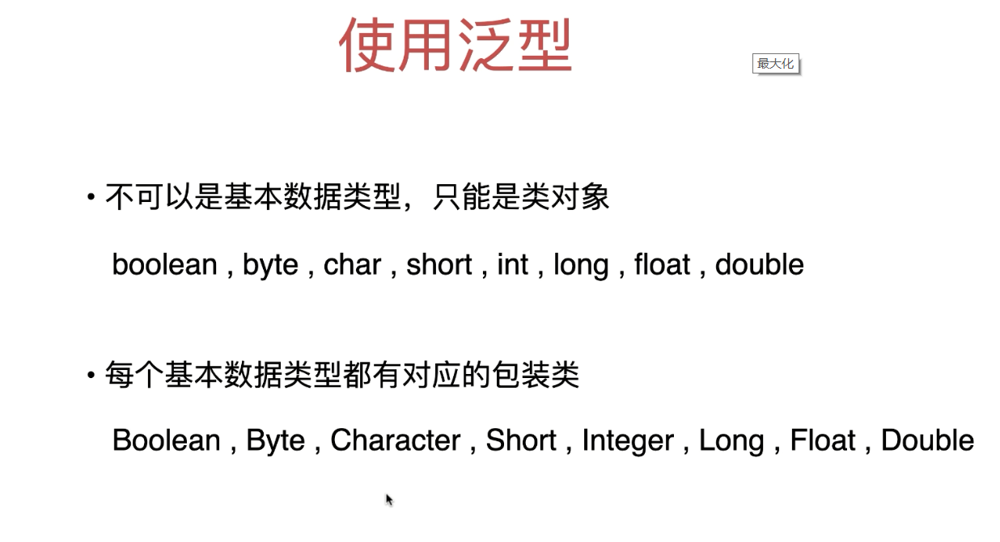
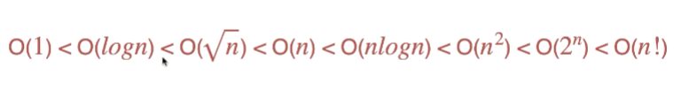
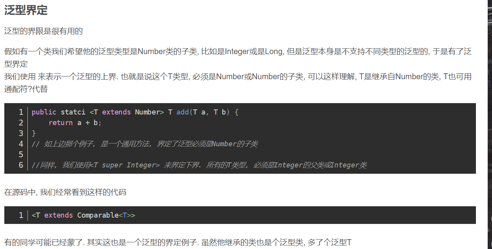
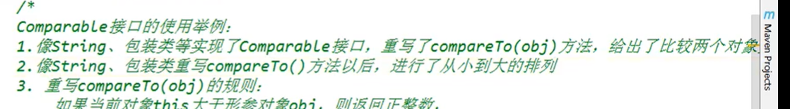
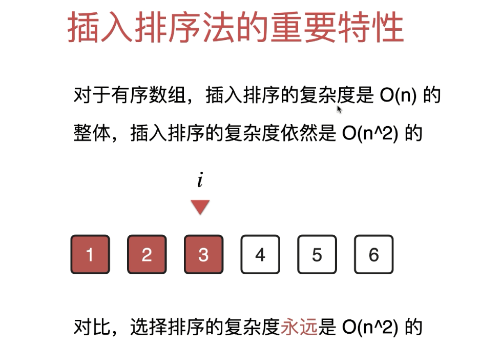

# 算法体系课

## 线性查找

~~~java
package com.muke.linearsearch;

public  class LinearSearch {
    private LinearSearch(){}//私有化构造器和静态方法配合使用
    public static void main(String[] args) {
        int[] data = {21,3,3,5,4,4,61,323};

        int search1 = LinearSearch.search(data, 323);
        System.out.println(search1);
        int search2 = LinearSearch.search(data, 3);
        System.out.println(search2);
    }
    public static int search(int[] data,int target) {
        for (int i = 0; i < data.length; i++) {
            if(data[i] == target) {
                return i;
            }

        }
        return -1;
    }

}

~~~

### 泛型

下面是泛型方法的定义

[public] [static] \<T> 返回值类型 方法名(T 参数列表)

泛型类

class DataHolder\<T>

类对象的判断一定要用equal值相等

== 判定的是引用相等

对于基本数据类型（byte，short，char，int，float，double，long，boolean）来说，他们是作为常量在方法区中的常量池里面以HashSet策略存储起来的，对于这样的字符串 "123" 也是相同的道理，在常量池中，一个常量只会对应一个地址，因此不管是再多的 123,"123" 这样的数据都只会存储一个地址，所以所有他们的引用都是指向的同一块地址，因此基本数据类型和String常量是可以直接通过==来直接比较的。

另外，对于基本数据的包装类型（Byte, Short, Character，Integer，Float, Double，Long,  Boolean）除了Float和Double之外，其他的六种都是实现了常量池的，因此对于这些数据类型而言，一般我们也可以直接通过==来判断是否相等

~~~java
public  class LinearSearch {
    private LinearSearch(){}//私有化构造器和静态方法配合使用
    public static void main(String[] args) {
        Integer[] data = {21,3,3,5,4,4,61,323};

        int search1 = LinearSearch.search(data, 323);
        System.out.println(search1);
        int search2 = LinearSearch.search(data, 3);
        System.out.println(search2);
    }
    public static  <E> int search(E[] data,E target) {//泛型方法加在返回值类型前面
        for (int i = 0; i < data.length; i++) {
            if(data[i].equals(target)) {//对象比较要用equals
                return i;
            }

        }
        return -1;
    }

}
~~~

#### 比较Student

~~~java
public class Student {
    private String name;

    public String getName() {
        return name;
    }

    public void setName(String name) {
        this.name = name;
    }

    public Student(String name) {
        this.name = name;
    }

    @Override
    public boolean equals(Object o) {
        if (this == o) return true;
        if (o == null || getClass() != o.getClass()) return false;
        Student student = (Student) o;
        return Objects.equals(name, student.name);
    }

    @Override
    public int hashCode() {
        return Objects.hash(name);
    }
}
~~~

~~~java
public  class LinearSearch {
    private LinearSearch(){}//私有化构造器和静态方法配合使用
    public static void main(String[] args) {
        Integer[] data = {21,3,3,5,4,4,61,323};

        int search1 = LinearSearch.search(data, 323);
        System.out.println(search1);
        int search2 = LinearSearch.search(data, 3);
        System.out.println(search2);
        
        
        Student[] data1 = {new Student("bobo1"),new Student("bobo2"),new Student("bobo")};
        Student bobo = new Student("bobo1");
        int search = LinearSearch.search(data1, bobo);
        System.out.println(search);
        
    }
    public static  <E> int search(E[] data,E target) {
        for (int i = 0; i < data.length; i++) {
            if(data[i].equals(target)) {
                return i;
            }

        }
        return -1;
    }

}

~~~

### 时间复杂度

### 生成测试用例数组

~~~java
public class ArrayGenerator {//静态方法和私有化构造器一起使用
    private ArrayGenerator(){}

    public static Integer[] generateOrderdArray(int n) {
        Integer[] arr = new Integer[n];
        for (int i = 0; i < n; i++) {
            arr[i] = i;
        }
        return arr;
    }
}
~~~

纳秒
　　ns（nanosecond）：纳秒， 时间单位。一秒的10亿分之一，即等于10的负9次方秒。常用作 内存读写速度的单位。
　　1纳秒=0.000001 毫秒
　　1纳秒=0.00000 0001秒

1秒 = 1000毫秒

1毫秒 = 1000000纳秒

java的System.currentTimeMillis()和System.nanoTime()区别:

java中System.nanoTime()返回的是纳秒，nanoTime而返回的可能是任意时间，甚至可能是负数……
java中System.currentTimeMillis()返回的毫秒，这个毫秒其实就是自1970年1月1日0时起的毫秒数.

### 时间度量

~~~java
public  class LinearSearch {
    private LinearSearch(){}//私有化构造器和静态方法配合使用
    public static void main(String[] args) {
        int[] dataSize = {1000000,10000000};
        for (int n : dataSize) {
            Integer[] data = ArrayGenerator.generateOrderdArray(n);
            long start = System.nanoTime();//纳秒
            for (int i = 0; i < 100; i++) {
                LinearSearch.search(data, n);
            }
            long end = System.nanoTime();
            double time = (end - start) / 1000000000.0;//一定要用浮点数否则显示不出来
            System.out.println("n = " + n + ", 100 runs : " + time + " s");
        }
        
    }
    public static  <E> int search(E[] data,E target) {
        for (int i = 0; i < data.length; i++) {
            if(data[i].equals(target)) {
                return i;
            }

        }
        return -1;
    }

}

~~~

## 选择排序

~~~java
package com.muke.selectionsort;

public class SelectionSort {
    private SelectionSort(){};

    public static void sort(int[] data) {
        for (int i = 0; i < data.length; i++) {
            int minIndex = i;
            for (int j = i; j < data.length ; j++) {
                if(data[j] < data[minIndex]) {
                    minIndex = j;

                }

            }
            swap(data,i,minIndex);
        }
    }
    private static void swap(int[] data,int i,int j) {
        int t = data[i];
        data[i] = data[j];
        data[j] = t;

    }

    public static void main(String[] args) {
        int[] arr = {3,5,1,6,4};
        SelectionSort.sort(arr);
        for (int i : arr) {
            System.out.print(i + " ");
        }
    }
}

~~~

改造成泛型

~~~java
package com.muke.selectionsort;

public class SelectionSort {
    private SelectionSort(){};

    public static <E extends Comparable<E>> void sort(E[] data) {
        for (int i = 0; i < data.length; i++) {
            int minIndex = i;
            for (int j = i; j < data.length ; j++) {
                if(data[j].compareTo(data[minIndex]) <0 ) {
                    minIndex = j;
                }
            }
            swap(data,i,minIndex);
        }
    }
    private static <E> void swap(E[] data,int i,int j) {
        E t = data[i];
        data[i] = data[j];
        data[j] = t;

    }

    public static void main(String[] args) {
        Integer[] arr = {3,5,1,6,4};
        SelectionSort.sort(arr);
        for (int i : arr) {
            System.out.print(i + " ");
        }
    }
}

~~~

实现comparable接口的类

~~~java
public class Student implements Comparable<Student>{
    private String name;
    private Integer score;

    public Student(String name, Integer score) {
        this.name = name;
        this.score = score;
    }

    @Override
    public boolean equals(Object o) {
        if (this == o) return true;
        if (o == null || getClass() != o.getClass()) return false;

        Student student = (Student) o;

        if (name != null ? !name.equals(student.name) : student.name != null) return false;
        return score != null ? score.equals(student.score) : student.score == null;
    }

    @Override
    public int hashCode() {
        int result = name != null ? name.hashCode() : 0;
        result = 31 * result + (score != null ? score.hashCode() : 0);
        return result;
    }

    @Override
    public String toString() {
        return "Student{" +
                "name='" + name + '\'' +
                ", score=" + score +
                '}';
    }

    @Override
    public int compareTo(Student another) {//返回正数则this>another
        return this.score - another.score;
    }
}

~~~

~~~java

public class SelectionSort {
    private SelectionSort(){};

    public static <E extends Comparable<E>> void sort(E[] data) {
        for (int i = 0; i < data.length; i++) {
            int minIndex = i;
            for (int j = i; j < data.length ; j++) {
                if(data[j].compareTo(data[minIndex]) <0 ) {//小于0则j<minIndex
                    minIndex = j;

                }

            }
            swap(data,i,minIndex);
        }
    }
    private static <E> void swap(E[] data,int i,int j) {
        E t = data[i];
        data[i] = data[j];
        data[j] = t;

    }

    public static void main(String[] args) {
        Integer[] arr = {3,5,1,6,4};
        SelectionSort.sort(arr);
        for (int i : arr) {
            System.out.print(i + " ");
        }
        System.out.println();

        Student[] student = {new Student("小明",20),
                new Student("小黄",60),
                new Student("晓东",100)};
        SelectionSort.sort(student);
        for (Student student1 : student) {
            System.out.println(student1);
        }
    }
}
~~~

生成随机数组以便于排序

~~~java
package com.muke.linearsearch;

import java.util.Random;

public class ArrayGenerator {
    private ArrayGenerator(){}
    
    public static Integer[] generateOrderdArray(int n) {
        Integer[] arr = new Integer[n];
        for (int i = 0; i < n; i++) {
            arr[i] = i;
        }
        return arr;
    }
    public static Integer[] generateRandomArray(int n,int bound) {
        Random random = new Random();
        Integer[] arr = new Integer[n];
        for (int i = 0; i < arr.length; i++) {
            arr[i] = random.nextInt(bound);//生成[0,n)之间的随机数
            
        }
        return arr;
    }
}
~~~

检验是否正确排序工具类SortingHelper

~~~java
public class SortingHelper {
    private SortingHelper(){}

    public static <E extends Comparable<E>> boolean isSort(E[] arr) {//E必须实现comparable接口
        for (int i = 1; i < arr.length; i++) {
            if(arr[i - 1].compareTo(arr[i]) > 0) {//arr[i+1]会越界所以从i=1开始循环，从i-1开始比较
                return false;
            }
        }
        return true;
    }
}

~~~

~~~java
package com.muke.selectionsort;

import com.muke.linearsearch.ArrayGenerator;
import com.muke.linearsearch.Student;
import com.muke.utils.SortingHelper;

public class SelectionSort {
    private SelectionSort(){};

    public static <E extends Comparable<E>> void sort(E[] data) {
        for (int i = 0; i < data.length; i++) {
            int minIndex = i;
            for (int j = i; j < data.length ; j++) {
                if(data[j].compareTo(data[minIndex]) <0 ) {
                    minIndex = j;

                }

            }
           swap(data,i,minIndex);
        }
    }
    private static <E> void swap(E[] data,int i,int j) {
        E t = data[i];
        data[i] = data[j];
        data[j] = t;

    }

    public static void main(String[] args) {

        int[] dataSize = {10000};
        for (int i : dataSize) {
            Integer[] array = ArrayGenerator.generateRandomArray(i, i);
            long start = System.nanoTime();

            SelectionSort.sort(array);
            long end = System.nanoTime();
            double time = (end - start)/1000000000.0;
            boolean sort = SortingHelper.isSort(array);
            System.out.println(sort);
            System.out.println(i + " time : " + time);
        }
    }
}

~~~

抽取测试算法性能的方法

~~~java
package com.muke.utils;

import com.muke.selectionsort.SelectionSort;

public class SortingHelper {
    private SortingHelper(){}

    public static <E extends Comparable<E>> boolean isSort(E[] arr) {
        for (int i = 1; i < arr.length; i++) {
            if(arr[i - 1].compareTo(arr[i]) > 0) {
                return false;
            }
        }
        return true;
    }

    public static <E extends Comparable<E>> void sortTest(String name,E[] data) {
        long start = System.nanoTime();
        if("SelectionSort".equals(name)) {
            SelectionSort.sort(data);
        }
        long end = System.nanoTime();
        double time = (end - start) / 1000000000.0;
        if(!SortingHelper.isSort(data)) {
            throw new RuntimeException(name + " fail");
        }
        System.out.println(String.format("%s  n = %d : %f s",name,data.length,time));
    }
}

~~~

## 插入排序

~~~java
package com.muke.insertionsort;

import com.muke.linearsearch.ArrayGenerator;
import com.muke.utils.SortingHelper;

public class InsertionSort {
    private InsertionSort(){}

    public static <E extends Comparable<E>> void sort(E[] arr) {
        for (int i = 0; i < arr.length; i++) {

            for (int j = i; j - 1 >= 0 ; j--) {
                if(arr[j].compareTo(arr[j-1]) <0) {
                    swap(arr,j,j-1);
                }else break;
            }
        }
    }

    private static <E> void swap(E[] arr,int i,int j) {

        E t = arr[i];
        arr[i] = arr[j];
        arr[j] = t;
    }

    public static void main(String[] args) {
        int[] dataSize = {10000,100000};
        for (int n : dataSize) {
            Integer[] array = ArrayGenerator.generateRandomArray(n, n);
            SortingHelper.sortTest("InsertionSort",array);
        }
    }
}

~~~

插入排序优化

之前的每次交换都是三次操作，现在用中间变量直接交换

~~~java
public static <E extends Comparable<E>> void sort1(E[] arr) {
        for (int i = 0; i < arr.length; i++) {
            E t = arr[i];
            int k;
            for (k = i; k - 1 >= 0 && t.compareTo(arr[k - 1]) < 0; k--) {
                arr[k] = arr[k - 1];
            }
            arr[k] = t;
        }
    }
~~~

测试用例

Arrays.copyOf(要复制的数组，要复制的长度)

~~~java
public static void main(String[] args) {
        int[] dataSize = {10000,100000};
        for (int n : dataSize) {
            Integer[] array = ArrayGenerator.generateRandomArray(n, n);
            Integer[] arr2 = Arrays.copyOf(array, array.length);
            SortingHelper.sortTest("InsertionSort",array);
            SortingHelper.sortTest("InsertionSort1",arr2);
        }
    }
~~~

