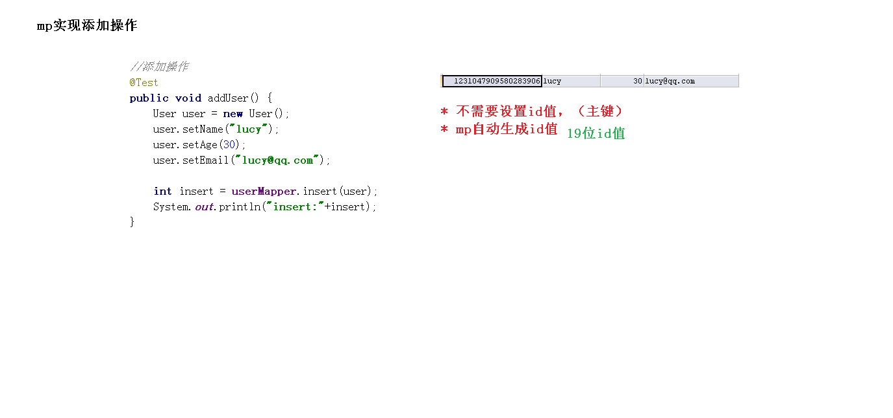
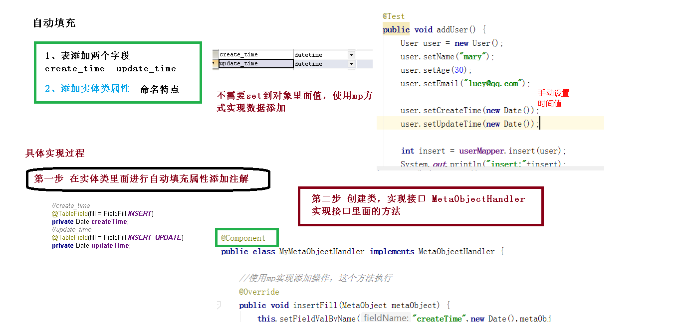

# MybatisPlus入门

## Lombok

- @Data只有get/set/equals/hashcode
- @AllArgsConstructor是有参构造器
- @NoArgsConstructor是无参构造器

## entity实体类的定义

```java
@Data
public class User {

    @TableId(type = IdType.ID_WORKER)
    private Long id;
    private String name;
    private Integer age;
    private String email;

    //数据库中create_time
    @TableField(fill = FieldFill.INSERT)
    private Date createTime;
    //数据库中update_time
    @TableField(fill = FieldFill.INSERT_UPDATE)
    private Date updateTime;

    @Version
    @TableField(fill = FieldFill.INSERT)
    private Integer version;
}
```

## Mapper接口映射

```java
@Component
public interface UserMapper extends BaseMapper<User> {
}

```

只需要定义一个接口继承BaseMapper<实体类>即可， BaseMapper<User>已经定义了许多接口（deleteById，insert，updateById），并实现了。

## 启动类application

```java 
@SpringBootApplication
public class MpdemoApplication {

    public static void main(String[] args) {
        SpringApplication.run(MpdemoApplication.class, args);
    }

}

```

## mybatis详细日志

在properties配置文件中添加如下配置语句可看到更详细的MySQL执行信息包括执行语句，引擎等

~~~Java
mybatis-plus.configuration.log-impl=org.apache.ibatis.logging.stdout.StdOutImpl
~~~

没加前


加了后


## Test测试类

~~~Java
 @Test
   public void contextLoads() {//查询所有
        List<User> user = userMapper.selectList(null);
        System.out.println(user);
    }

  @Test
    public void  addUser() {//添加数据，传入添加的对象，返回添加的条数
        User user = new User();//id是主键自动生成，不需要设置
        user.setName("赵四");
        user.setAge(42);
        user.setEmail("365@qq.com");

        int i = userMapper.insert(user);
        System.out.println("insert"+i);//i = 1
    }
 @Test
    public void updateUser() {//通过ID修改数据，传入要修改的实体类对象，对应于数据库中的表，设置ID和要修改的内容
        //放回修改的条数
        User user = new User();
        user.setId(1355110654293319682L);
        user.setAge(1);
        int row = userMapper.updateById(user);
        System.out.println(row);
    }
~~~



## 主键生成策略


自动增长分表的时候都要获取上一张表的最后一个ID不方便

UUID排序不方便

Redis应用较多，适合使用来生成每天从0开始的流水号。比如订单号=日期+当日自增长号。可以每天在Redis中生成一个Key，使用INCR进行累加

snowflake是Twitter开源的分布式ID生成算法，结果是一个**long型**的ID。其核心思想是：使用41bit作为毫秒数，10bit作为机器的ID（5个bit是数据中心，5个bit的机器ID），12bit作为毫秒内的流水号（意味着每个节点在每毫秒可以产生 4096 个 ID），最后还有一个符号位，永远是0

input/none:手动输入

uuid:电脑随机生成唯一的ID

ID_WORKER:mp自带，针对数值类型的属性

ID_WORKER_STR:mp自带，针对字符串类型的属性

## 自动填充

数据库中的字段 '_',对应到实体类中要用驼峰命名比如create_time-->createTime



~~~java 
@Component
public class MyMetaObjectHandler implements MetaObjectHandler {

    @Override
    public void insertFill(MetaObject metaObject) {//添加的时候执行
        //参数是类中的属性名，不是数据库中的字段
        this.setFieldValByName("createTime",new Date(),metaObject);//类的属性名，要自动生成的值，metaObject
        this.setFieldValByName("updateTime",new Date(),metaObject);
        this.setFieldValByName("version",1,metaObject);
    }

    @Override
    public void updateFill(MetaObject metaObject) {//修改的时候执行
        this.setFieldValByName("updateTime",new Date(),metaObject);
    }
}
~~~

## 乐观锁


悲观锁，只能有一个人操作数据，效率低，一般不用

乐观锁：当要更新一条记录的时候，希望这条记录没有被别人更新，也就是说实现线程安全的数据更新

**乐观锁实现方式：**更新的时候先获取version，更新完成后先比对version是否一致，一致则修改，否则修改失败

- 取出记录时，获取当前version
- 更新时，带上这个version
- 执行更新时， set version = newVersion where version = oldVersion
- 如果version不对，就更新失败


设置version的 初始值为1


## Arrays.asList()

方法是将数组转化为list

```
(1) 该方法对于基本数据类型的数组支持并不好,当数组是基本数据类型时不建议使用 
(2) 当使用asList()方法时，数组就和列表链接在一起了. 
     当更新其中之一时，另一个将自动获得更新。 
 注意:仅仅针对对象数组类型,基本数据类型数组不具备该特性 
(3) asList得到的数组是的没有add和remove方法的
```

~~~java
//通过多个ID，批量查询，要传入Collection数据
@Test
public void testSelectBatchIds(){

    List<User> users = userMapper.selectBatchIds(Arrays.asList(1, 2, 3));//也可以new ArrayList
    users.forEach(System.out::println);
}
~~~


## 分页


## 逻辑删除


配置后执行物理删除的代码，会自动变为逻辑删除的代码

deleted字段的默认值除了可以再数据库中设置default值还可以用MyatisPlus的自动填充

**(2）实体类添加deleted \**字段\****

并加上 @TableLogic 注解 和 @TableField(fill = FieldFill.INSERT) 注解

 

```java
@TableLogic
@TableField(fill = FieldFill.INSERT)
private Integer deleted;
```

**（3）元对象处理器接口添加deleted的insert默认值**

 

```java
@Override
public void insertFill(MetaObject metaObject) {
    ......
    this.setFieldValByName("deleted", 0, metaObject);
}
```

mp默认删除为1，未删除为0，可在properties文件中自行设置

~~~properties
mybatis-plus.global-config.db-config.logic-delete-value=1
mybatis-plus.global-config.db-config.logic-not-delete-value=0
~~~

删除后测试查询的结果

~~~mysql
SELECT id,name,age,email,create_time,update_time,deleted FROM user WHERE deleted=0

~~~

## 性能分析

性能分析拦截器，用于输出每条 SQL 语句及其执行时间

SQL 性能执行分析,开发环境使用，超过指定时间，停止运行。有助于发现问题

### 配置插件

**（1）参数说明**

参数：maxTime： SQL 执行最大时长，超过自动停止运行，有助于发现问题。

参数：format： SQL是否格式化，默认false。

**（2）在 MybatisPlusConfig 中配置**

 

```java
/**
 * SQL 执行性能分析插件
 * 开发环境使用，线上不推荐。 maxTime 指的是 sql 最大执行时长
 */
@Bean
@Profile({"dev","test"})// 设置 dev test 环境开启
public PerformanceInterceptor performanceInterceptor() {
    PerformanceInterceptor performanceInterceptor = new PerformanceInterceptor();
    performanceInterceptor.setMaxTime(100);//ms，超过此处设置的ms则sql不执行
    performanceInterceptor.setFormat(true);
    return performanceInterceptor;
}
```

**（3）Spring Boot 中设置dev环境**

 

```properties
#环境设置：dev、test、prod
spring.profiles.active=dev
```

## 条件构造器wrapper


~~~Java
//直接拼接到sql最后，只能调用一次,多次调用以最后一次为准 有sql注入的风险,请谨慎使用
@Test
public void testSelectListLast() {

    QueryWrapper<User> queryWrapper = new QueryWrapper<>();
    queryWrapper.last("limit 1");

    List<User> users = userMapper.selectList(queryWrapper);
    users.forEach(System.out::println);
}
查询指定列
@Test
public void testSelectListColumn() {

    QueryWrapper<User> queryWrapper = new QueryWrapper<>();
    queryWrapper.select("id", "name", "age");

    List<User> users = userMapper.selectList(queryWrapper);
    users.forEach(System.out::println);
}
~~~

# MyBatis-Plus Service CRUD 接口 跟Mapper CRUD 接口区别

Service CRUD 返回的boolean的值，Mapper CRUD 返回的是int值。

service是mapper的增强，有批处理的方法