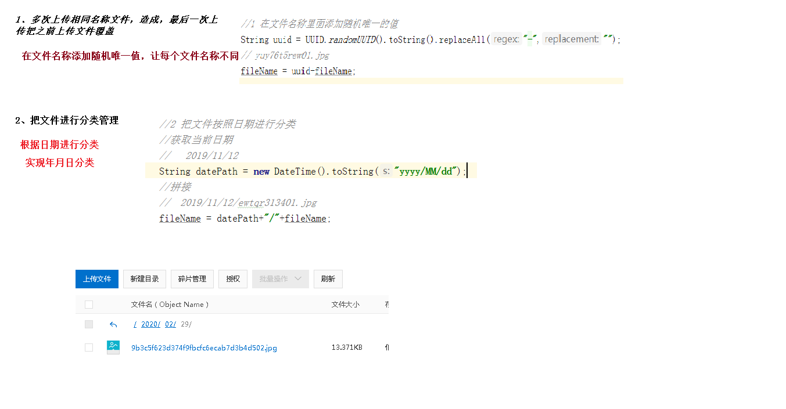
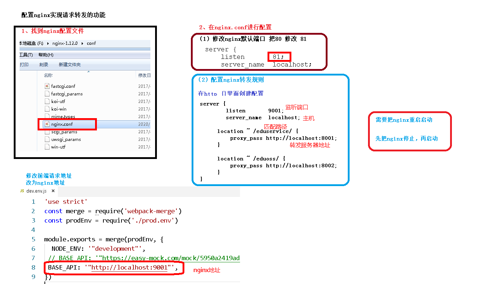

# 阿里云OSS

## 设置配置文件

~~~properties
#服务端口
server.port=8002
#服务名
spring.application.name=service-oss

#环境设置：dev、test、prod
spring.profiles.active=dev

#阿里云 OSS
#不同的服务器，地址不同
aliyun.oss.file.endpoint=
aliyun.oss.file.keyid=
aliyun.oss.file.keysecret=
#bucket可以在控制台创建，也可以使用java代码创建
aliyun.oss.file.bucketname=
~~~

## 创建工具类读取配置文件信息

~~~java
package com.atguigu.oss.utils;

import org.springframework.beans.factory.InitializingBean;
import org.springframework.beans.factory.annotation.Value;
import org.springframework.stereotype.Component;

//当项目启动，spring自动加载接口方法
@Component
public class ConstantPropertiesUtils implements InitializingBean {
    //读取配置文件的内容

    @Value("${aliyun.oss.file.endpoint}")//spring中的读取配置文件中的信息并赋值给属性
    private String endpoint;

    @Value("${aliyun.oss.file.keyid}")
    private String keyId;
    @Value("${aliyun.oss.file.keysecret}")
    private String keySecret;
    @Value("${aliyun.oss.file.bucketname}")
    private String  bucketName;

    public static String END_POINT;
    public static String ACCESS_KEY_ID;
    public static String ACCESS_KEY_SECRET;
    public static String BUCKET_NAME;

    @Override
    public void afterPropertiesSet() throws Exception {
        END_POINT = endpoint;
        ACCESS_KEY_ID = keyId;
        ACCESS_KEY_SECRET = keySecret;
        BUCKET_NAME = bucketName;
    }
}

~~~

## control

~~~java
@RestController
@RequestMapping("/eduoss/fileoss")
@CrossOrigin
public class OssController {

    @Autowired
    private OssService ossService;

    //上传头像的方法
    @PostMapping
    public R uploadOssFile(MultipartFile file) {
        //获取上传文件 MultipartFile,用来接受前台传过来的文件
        //返回上传到oss的路径
        String url = ossService.uploadFileAvatar(file);

        return R.ok().data("url",url);
    }
}

~~~

service

~~~java
import org.joda.time.DateTime;

@Service
public class OssServiceImpl implements OssService {
    //上传头像到oss
    @Override
    public String uploadFileAvatar(MultipartFile file) {

        String endpoint = ConstantPropertiesUtils.END_POINT;
        String accessKeyId = ConstantPropertiesUtils.ACCESS_KEY_ID;
        String accessKeySecret = ConstantPropertiesUtils.ACCESS_KEY_SECRET;
        String bucketName = ConstantPropertiesUtils.BUCKET_NAME;

        try {
            // 创建OSSClient实例。
            OSS ossClient = new OSSClientBuilder().build(endpoint, accessKeyId, accessKeySecret);
            //获取文件名称
            String fileName = file.getOriginalFilename();

            //在文件名称里添加随机唯一值
            String uuid = UUID.randomUUID().toString().replaceAll("-","");
            fileName = uuid + fileName;

            //把文件按日期进行分类
            //2021/11/21/01.jpg
            String dataPath = new DateTime().toString("yyyy/MM/dd");
            fileName = dataPath + "/" + fileName;

            // 上传文件流。
            InputStream inputStream = file.getInputStream();
            //第二个参数 文件路径和名称
            ossClient.putObject(bucketName, fileName, inputStream);

            // 关闭OSSClient。
            ossClient.shutdown();
			//拼接地址返回
           // https://edu-210205.oss-cn-chengdu.aliyuncs.com/01.png
            String url = "https://" + bucketName + "." + endpoint + "/" + fileName;
            return url;

        } catch (Exception e) {
            e.printStackTrace();
            return null;
        }

    }
}
~~~

# Nginx

# 上传图片前端实现

~~~vue
<template>
  

    添加讲师表单

    <el-form label-width="120px">
      <el-form-item label="讲师名称">
        <el-input v-model="teacher.name" />
      </el-form-item>
      <el-form-item label="讲师排序">
        <el-input-number
          v-model="teacher.sort"
          controls-position="right"
          min="0"
        />
      </el-form-item>
      <el-form-item label="讲师头衔">
        <el-select v-model="teacher.level" clearable placeholder="请选择">
          <!--
            数据类型一定要和取出的json中的一致，否则没法回填
            因此，这里value使用动态绑定的值，保证其数据类型是number
          -->
          <el-option :value="1" label="高级讲师" />
          <el-option :value="2" label="首席讲师" />
        </el-select>
      </el-form-item>
      <el-form-item label="讲师资历">
        <el-input v-model="teacher.career" />
      </el-form-item>
      <el-form-item label="讲师简介">
        <el-input v-model="teacher.intro" :rows="10" type="textarea" />
      </el-form-item>

      <!-- 讲师头像：TODO -->

      <!-- 讲师头像 -->
      <el-form-item label="讲师头像">
        <!-- 头衔缩略图 -->
        <pan-thumb :image="teacher.avatar" />
        <!-- 文件上传按钮 -->
        <el-button type="primary" icon="el-icon-upload" @click="imagecropperShow = true"  >更换头像  </el-button>

        <!--
            v-show：是否显示上传组件
            :key：类似于id，如果一个页面多个图片上传控件，可以做区分
            :url：后台上传的url地址
            @close：关闭上传组件
            @crop-upload-success：上传成功后的回调 -->
        <image-cropper
          v-show="imagecropperShow"
          :width="300"
          :height="300"
          :key="imagecropperKey"
          :url="BASE_API + '/eduoss/fileoss'"
          field="file"
          @close="close"
          @crop-upload-success="cropSuccess"
        />
      </el-form-item>

      <el-form-item>
        <el-button
          :disabled="saveBtnDisabled"
          type="primary"
          @click="saveOrUpdate"
          >保存</el-button
        >
      </el-form-item>
    </el-form>
  

</template>

~~~

# EasyExcel

