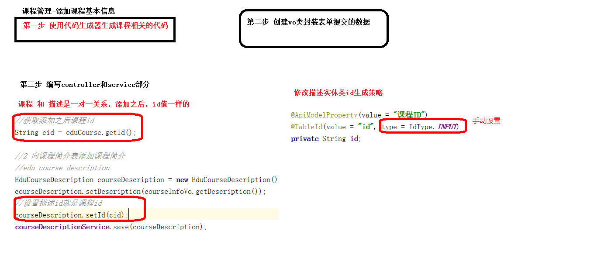

# 课程分类

ref 属性涉及Dom 元素的获取(el-form表单对象)。我们首先需要了解下javasrcipt 是如何获取Dom 元素是通过：document.querySelector（".input"）获取dom元素节点 。Vue 为简化DOM获取方法提出了ref 属性和\$refs 对象。一般的操作流程是:ref 绑定控件，$refs 获取控件。

~~~vue
<template>
  

    <el-form label-width="120px">
      <el-form-item label="信息描述">
        <el-tag type="info">excel模版说明</el-tag>
        <el-tag>
          <i class="el-icon-download"/>
          <a :href="'/static/guli.xlsx'">点击下载模版</a>
        </el-tag>

      </el-form-item>

      <el-form-item label="选择Excel">
        <el-upload
          ref="upload"
          :auto-upload="false"
          :on-success="fileUploadSuccess"
          :on-error="fileUploadError"
          :disabled="importBtnDisabled"
          :limit="1"//一次只能上传一条
          :action="BASE_API+'/eduservice/subject/addSubject'"
          name="file"
          accept="application/vnd.ms-excel">
          <el-button slot="trigger" size="small" type="primary">选取文件</el-button>
          <el-button
            :loading="loading"
            style="margin-left: 10px;"
            size="small"
            type="success"
            @click="submitUpload">上传到服务器</el-button>
        </el-upload>
      </el-form-item>
    </el-form>
  

</template>

~~~

课程列表显示

# 添加课程信息

创建vo类接受信息

~~~java
package com.atguigu.eduservice.entity.vo;

import io.swagger.annotations.ApiModelProperty;
import lombok.Data;

import java.math.BigDecimal;

@Data
public class CourseVo {
    @ApiModelProperty(value = "课程ID")
    private String id;

    @ApiModelProperty(value = "课程讲师ID")
    private String teacherId;

    @ApiModelProperty(value = "课程专业ID")
    private String subjectId;

    @ApiModelProperty(value = "课程标题")
    private String title;

    @ApiModelProperty(value = "课程销售价格，设置为0则可免费观看")
    private BigDecimal price;//用BigDecimal价格比float，double更精确

    @ApiModelProperty(value = "总课时")
    private Integer lessonNum;

    @ApiModelProperty(value = "课程封面图片路径")
    private String cover;

    @ApiModelProperty(value = "课程简介")
    private String description;
}

~~~

controller

~~~java
package com.atguigu.eduservice.controller;

import com.atguigu.commonutils.R;
import com.atguigu.eduservice.entity.vo.CourseVo;
import com.atguigu.eduservice.service.EduCourseService;
import org.springframework.beans.factory.annotation.Autowired;
import org.springframework.web.bind.annotation.*;

/**
 * 

 * 课程 前端控制器
 * 

 *
 * @author testjava
 * @since 2021-03-10
 */
@RestController
@RequestMapping("/eduservice/course")
@CrossOrigin
public class EduCourseController {
    @Autowired
    private EduCourseService courseService;

    //添加课程基本信息
    @PostMapping("addCourseInfo")
    public R addCourseInfo(@RequestBody CourseVo courseVo) {
        courseService.saveCourseInfo(courseVo);
        return R.ok();
    }

}

~~~

service

~~~java

@Service
public class EduCourseServiceImpl extends ServiceImpl<EduCourseMapper, EduCourse> implements EduCourseService {

    @Autowired
    EduCourseDescriptionService courseDescriptionService;//mapper是每个类的，这里注入用service实现添加

    @Override
    public void saveCourseInfo(CourseVo courseVo) {
        //把courseVo中的信息封装到eduCourse中并保存
        EduCourse eduCourse = new EduCourse();
        BeanUtils.copyProperties(courseVo,eduCourse);
        int insert = baseMapper.insert(eduCourse);
        if(insert == 0) {
            throw new GuliException(20001, "添加失败");
        }

        String cid = eduCourse.getId();//使course和course_description表的id保持一致

        EduCourseDescription description = new EduCourseDescription();
        description.setDescription(courseVo.getDescription());
        description.setId(cid);//修改字段为input，手动添加

        courseDescriptionService.save(description);
    }
}

~~~

edu_description实体类

  **@TableId(value = "id", type = IdType.INPUT)//自己设置**

~~~java

@Data
@EqualsAndHashCode(callSuper = false)
@Accessors(chain = true)
@ApiModel(value="EduCourseDescription对象", description="课程简介")
public class EduCourseDescription implements Serializable {

    private static final long serialVersionUID = 1L;

    @ApiModelProperty(value = "课程ID")
    @TableId(value = "id", type = IdType.INPUT)//自己设置
    private String id;

    @ApiModelProperty(value = "课程简介")
    private String description;

    @ApiModelProperty(value = "创建时间")
    @TableField(fill = FieldFill.INSERT)
    private Date gmtCreate;

    @ApiModelProperty(value = "更新时间")
    @TableField(fill = FieldFill.INSERT_UPDATE)
    private Date gmtModified;

}

~~~

创建和更新时间要加上@TableField(fill = FieldFill.INSERT)字段