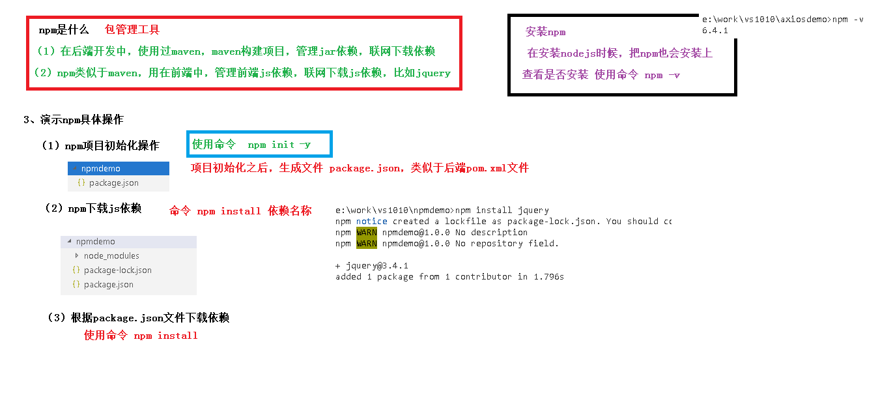
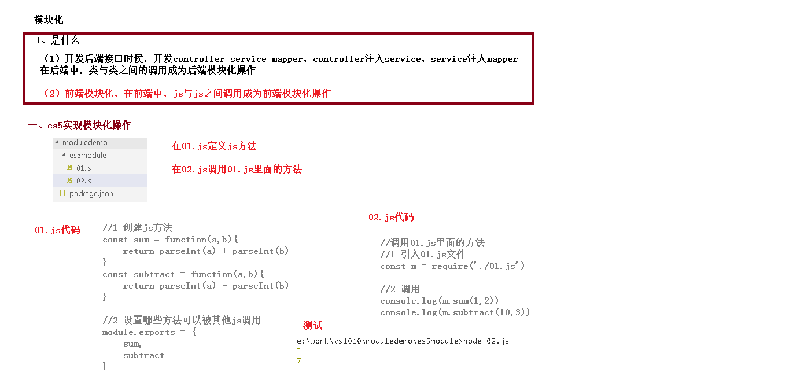
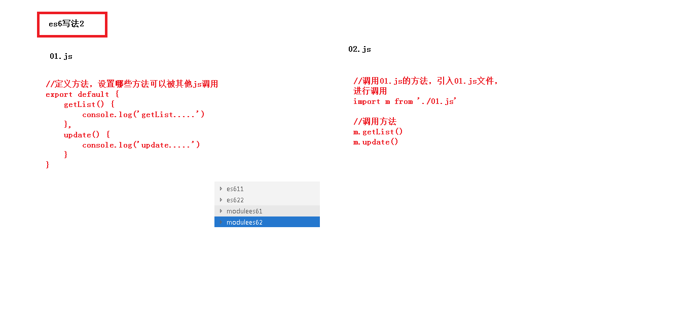
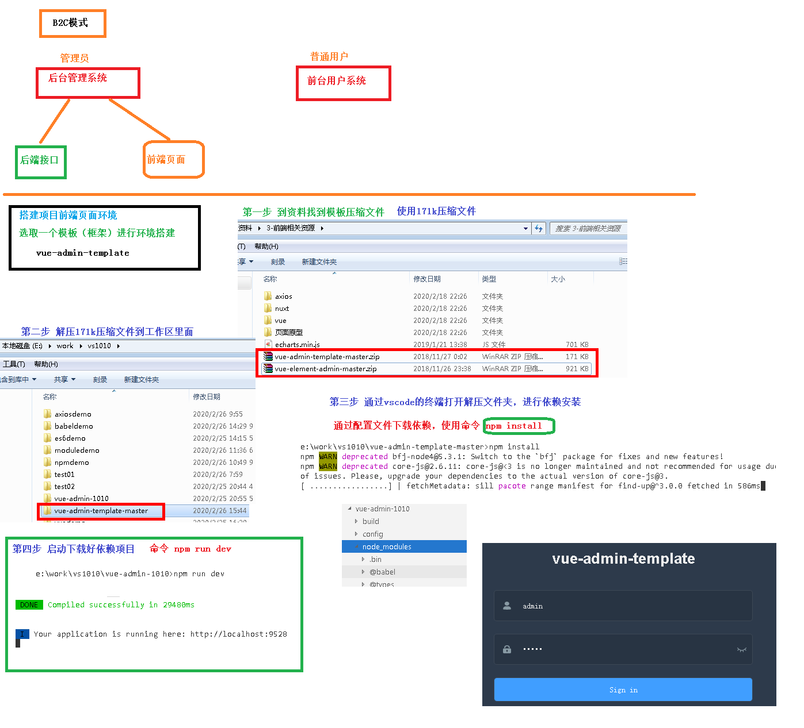
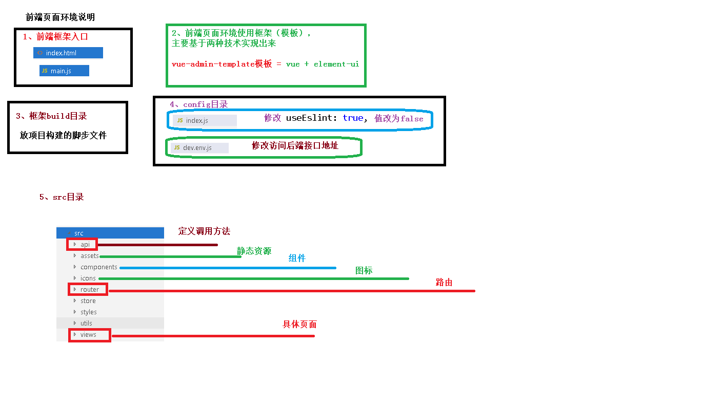
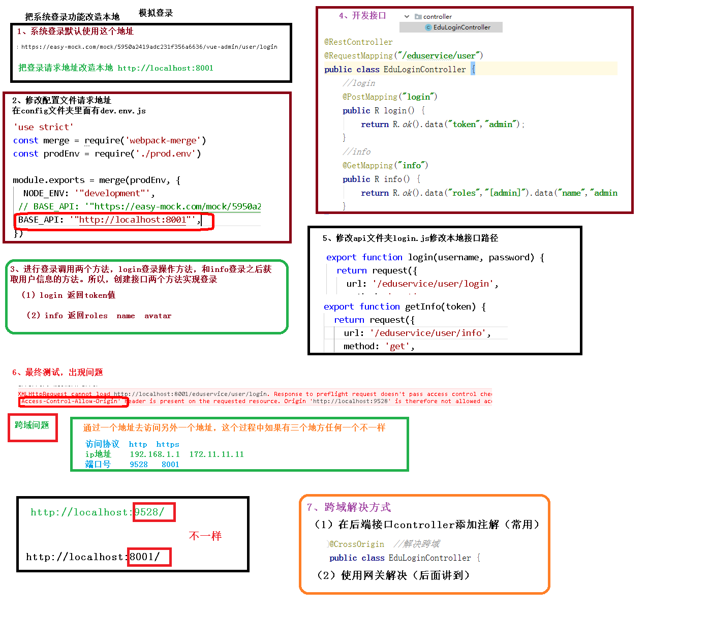
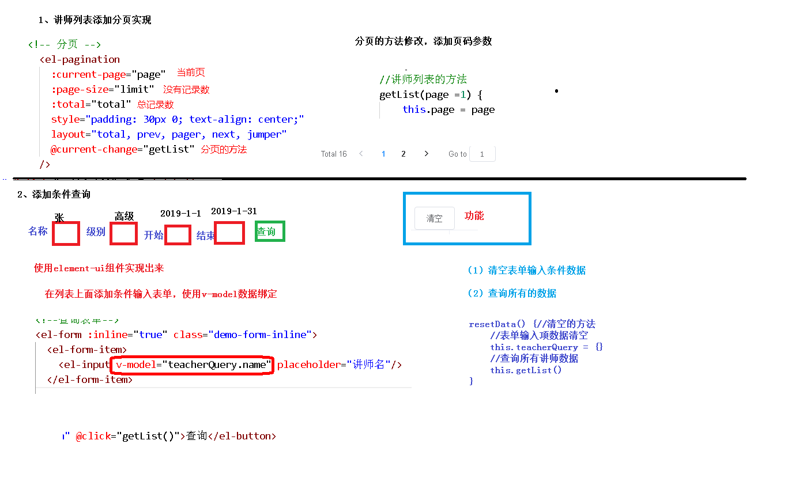

# ES6

## vscode初始化

## es6

## let声明变量

~~~javascript
// var 声明的变量没有局部作用域
// let 声明的变量  有局部作用域
{
var a = 0
let b = 1
}
console.log(a)  // 0
console.log(b)  // ReferenceError: b is not defined

// var 可以声明多次
// let 只能声明一次
var m = 1
var m = 2
let n = 3
let n = 4
console.log(m)  // 2
console.log(n)  // Identifier 'n' has already been declared
~~~

## const声明变量

~~~javascript
// 1、声明之后不允许改变    
const PI = "3.1415926"
PI = 3  // TypeError: Assignment to constant variable.

// 2、一但声明必须初始化，否则会报错
const MY_AGE  // SyntaxError: Missing initializer in const declaration
~~~

## 解构赋值

~~~javascript
//数组解构
// 传统
let a = 1, b = 2, c = 3
console.log(a, b, c)
// ES6
let [x, y, z] = [1, 2, 3]
console.log(x, y, z)
~~~

~~~javascript
//2、对象解构
let user = {name: 'Helen', age: 18}
// 传统
let name1 = user.name
let age1 = user.age
console.log(name1, age1)
// ES6
let { name, age } =  user//注意：结构的变量必须是user中的属性
console.log(name, age)
~~~

## 模板字符串

~~~javascript
// 1、多行字符串
let string1 =  `Hey,
can you stop angry now?`
console.log(string1)
// Hey,
// can you stop angry now?

// 2、字符串插入变量和表达式。变量名写在 ${} 中，${} 中可以放入 JavaScript 表达式。
let name = "Mike"
let age = 27
let info = `My Name is ${name},I am ${age+1} years old next year.`
console.log(info)
// My Name is Mike,I am 28 years old next year.

// 3、字符串中调用函数
function f(){
    return "have fun!"
}
let string2 = `Game start,${f()}`
console.log(string2);  // Game start,have fun!
~~~

## 声明对象简写

~~~javascript
const age = 12
const name = "Amy"

// 传统
const person1 = {age: age, name: name}
console.log(person1)

// ES6
const person2 = {age, name}
console.log(person2) //{age: 12, name: "Amy"}
~~~

## 定义方法简写

~~~javascript
// 传统
const person1 = {
    sayHi:function(){
        console.log("Hi")
    }
}
person1.sayHi();//"Hi"

// ES6
const person2 = {
    sayHi(){
        console.log("Hi")
    }
}
person2.sayHi()  //"Hi"
~~~

## 对象拓展运算符

~~~javascript
// 1、拷贝对象
let person1 = {name: "Amy", age: 15}
let someone = { ...person1 }
console.log(someone)  //{name: "Amy", age: 15}

// 2、合并对象
let age = {age: 15}
let name = {name: "Amy"}
let person2 = {...age, ...name}
console.log(person2)  //{age: 15, name: "Amy"}
~~~

## 箭头函数

参数 => 函数体

箭头函数多用于匿名函数的定义

~~~javascript
// 传统
var f1 = function(a){
    return a
}
console.log(f1(1))

// ES6
var f2 = a => a
console.log(f2(1))

// 当箭头函数没有参数或者有多个参数，要用 () 括起来。
// 当箭头函数函数体有多行语句，用 {} 包裹起来，表示代码块，
// 当只有一行语句，并且需要返回结果时，可以省略 {} , 结果会自动返回。
var f3 = (a,b) => {
    let result = a+b
    return result
}
console.log(f3(6,2))  // 8

// 前面代码相当于：
var f4 = (a,b) => a+b
~~~

# VUE

~~~javascript
<!-- id标识vue作用的范围,这里面显示数据 -->

    <!-- {{}} 插值表达式，绑定vue中的data数据 -->
    {{ message }}

~~~

## 制作代码片段

文件 =>  首选项 => 用户代码片段 => 新建全局代码片段/或文件夹代码片段：vue-html.code-snippets

~~~html
{
	"vue htm": {
		"scope": "html",
		"prefix": "vuehtml",
		"body": [
			"<!DOCTYPE html>",
			"<html lang=\"en\">",
			"",
			"<head>",
			"    <meta charset=\"UTF-8\">",
			"    <meta name=\"viewport\" content=\"width=device-width, initial-scale=1.0\">",
			"    <meta http-equiv=\"X-UA-Compatible\" content=\"ie=edge\">",
			"    <title>Document</title>",
			"</head>",
			"",
			"<body>",
			"    
",
			"",
			"    
",
			"    ",
			"    ",
			"</body>",
			"",
			"</html>",
		],
		"description": "my vue template in html"
	}
}
~~~

## 基本数据渲染和指令

你看到的 v-bind 特性被称为指令。指令带有前缀 v- 
除了使用插值表达式{{}}进行数据渲染，也可以使用 v-bind指令，它的简写的形式就是一个冒号（:）

~~~html
<!DOCTYPE html>
<html lang="en">

<head>
    <meta charset="UTF-8">
    <meta name="viewport" content="width=device-width, initial-scale=1.0">
    <meta http-equiv="X-UA-Compatible" content="ie=edge">
    <title>Document</title>
</head>

<body>
    

        <!-- 如果要将模型数据绑定在html属性中，则使用 v-bind 指令
     此时title中显示的是模型数据,不在属性中引用则用双大括号就行了
-->
        <h1 v-bind:title="message">{{content}}</h1>
        <!-- v-bind 指令的简写形式： 冒号（:） -->
			<h1 :title="message">
   				 {{content}}
			</h1>
    

    
    
</body>

</html>
~~~

## 双向数据绑定

双向数据绑定和单向数据绑定：使用 v-model 进行双向数据绑定

~~~html
data: {
    searchMap:{
        keyWord: '尚硅谷'
    }
}

<!-- 单向中只能自己变，而双向中变化了，其他相同的变量也会跟着变化-->
<!-- v-bind:value只能进行单向的数据渲染 -->
<input type="text" v-bind:value="searchMap.keyWord">
<!-- v-model 可以进行双向的数据绑定  -->
<input type="text" v-model="searchMap.keyWord">

您要查询的是：{{searchMap.keyWord}}

~~~

## 事件

在前面的例子基础上，data节点中增加 result，增加 methods节点 并定义 search方法

tml中增加 button 和 p

使用 v-on 进行数件处理，v-on:click 表示处理鼠标点击事件，事件调用的方法定义在 vue 对象声明的 methods 节点中

~~~html
<!DOCTYPE html>
<html lang="en">

<head>
    <meta charset="UTF-8">
    <meta name="viewport" content="width=device-width, initial-scale=1.0">
    <meta http-equiv="X-UA-Compatible" content="ie=edge">
    <title>Document</title>
</head>

<body>
    

        <!--vue绑定事件-->
        <button v-on:click="search()">查询</button>

        <!--vue绑定事件简写-->
        <button @click="search()">查询1</button>
    

    
    
</body>

</html>
~~~

## 条件渲染

~~~html
<!DOCTYPE html>
<html lang="en">

<head>
    <meta charset="UTF-8">
    <meta name="viewport" content="width=device-width, initial-scale=1.0">
    <meta http-equiv="X-UA-Compatible" content="ie=edge">
    <title>Document</title>
</head>

<body>
    

        <input type="checkbox" v-model="ok"/>是否同意
        <!--条件指令 v-if  v-else -->
        <h1 v-if="ok">尚硅谷</h1> 选中复选框
        <h1 v-else>谷粒学院</h1>  未选中复选框
    

    
    
</body>

</html>
~~~

## 修饰符

修饰符 (Modifiers) 是以半角句号（.）指明的特殊后缀，用于指出一个指令应该以特殊方式绑定。

例如，.prevent 修饰符告诉 v-on 指令对于触发的事件调用 event.preventDefault()：

即阻止事件原本的默认行为

~~~html
<!DOCTYPE html>
<html lang="en">

<head>
    <meta charset="UTF-8">
    <meta name="viewport" content="width=device-width, initial-scale=1.0">
    <meta http-equiv="X-UA-Compatible" content="ie=edge">
    <title>Document</title>
</head>

<body>
    

        <form action="save" v-on:submit.prevent="onSubmit">
            <input type="text" id="name" v-model="user.username"/>
            <button type="submit">保存</button>
        </form>
    

    
    
</body>

</html>
~~~

## 列表渲染

~~~html
<!DOCTYPE html>
<html lang="en">

<head>
    <meta charset="UTF-8">
    <meta name="viewport" content="width=device-width, initial-scale=1.0">
    <meta http-equiv="X-UA-Compatible" content="ie=edge">
    <title>Document</title>
</head>

<body>
    

        <ul>
            <li v-for="n in 10"> {{n}} </li>
        </ul>
        <ol>
            <!-- 如果想获取索引，则使用index关键字，注意，圆括号中的index必须放在后面 -->
            <li v-for="(n,index) in 10">{{n}} -- {{index}}</li>
        </ol>

        

        <table border="1">
            <tr v-for="user in userList">
                <td>{{user.id}}</td>
                <td>{{user.username}}</td>
                <td>{{user.age}}</td>
            </tr>
        </table>

    

    
    
</body>

</html>
~~~

## 组件

组件可以扩展 HTML 元素，封装可重用的代码。

组件系统让我们可以用独立可复用的小组件来构建大型应用，几乎任意类型的应用的界面都可以抽象为一个组件树：

~~~html
<!DOCTYPE html>
<html lang="en">

<head>
    <meta charset="UTF-8">
    <meta name="viewport" content="width=device-width, initial-scale=1.0">
    <meta http-equiv="X-UA-Compatible" content="ie=edge">
    <title>Document</title>
</head>

<body>
    

        <Navbar></Navbar>
    

    
    
</body>

</html>
~~~

全局组件

~~~html
// 定义全局组件
Vue.component('Navbar', {
    template: '<ul><li>首页</li><li>学员管理</li><li>讲师管理</li></ul>'
})
~~~

~~~html
<!DOCTYPE html>
<html lang="en">

<head>
    <meta charset="UTF-8">
    <meta name="viewport" content="width=device-width, initial-scale=1.0">
    <meta http-equiv="X-UA-Compatible" content="ie=edge">
    <title>Document</title>
</head>

<body>
    

        <Navbar></Navbar>
    

    
    
    
</body>

</html>
~~~

## 生命周期和debug

~~~html
<!DOCTYPE html>
<html lang="en">

<head>
    <meta charset="UTF-8">
    <meta name="viewport" content="width=device-width, initial-scale=1.0">
    <meta http-equiv="X-UA-Compatible" content="ie=edge">
    <title>Document</title>
</head>

<body>
    

           hello
           
    

    
    
</body>

</html>
~~~

## 路由

~~~html
<!DOCTYPE html>
<html lang="en">

<head>
    <meta charset="UTF-8">
    <meta name="viewport" content="width=device-width, initial-scale=1.0">
    <meta http-equiv="X-UA-Compatible" content="ie=edge">
    <title>Document</title>
</head>

<body>
    

            <h1>Hello App!</h1>
            

                <!-- 使用 router-link 组件来导航. -->
                <!-- 通过传入 `to` 属性指定链接. -->
                <!-- <router-link> 默认会被渲染成一个 `<a>` 标签 -->
                <router-link to="/">首页</router-link>
                <router-link to="/student">会员管理</router-link>
                <router-link to="/teacher">讲师管理</router-link>
            

            <!-- 路由出口 -->
            <!-- 路由匹配到的组件将渲染在这里 -->
            <router-view></router-view>
    

    
    

    
</body>

</html>
~~~

## axios

~~~html
<!DOCTYPE html>
<html lang="en">

<head>
    <meta charset="UTF-8">
    <meta name="viewport" content="width=device-width, initial-scale=1.0">
    <meta http-equiv="X-UA-Compatible" content="ie=edge">
    <title>Document</title>
</head>

<body>
    

        <!--把userList数组里面数据显示 使用v-for指令 -->
        

            {{user.name}} -- {{user.age}}
        

    

    
    
    
</body>

</html>
~~~

## node.js

## npm

## babel

## 模块化

## webpack

# 搭建环境

## 项目目录结构

~~~java
. 
├── build // 构建脚本
├── config // 全局配置 
├── node_modules // 项目依赖模块
├── src //项目源代码
├── static // 静态资源
└── package.jspon // 项目信息和依赖配置

src 
├── api // 各种接口 
├── assets // 图片等资源 
├── components // 各种公共组件，非公共组件在各自view下维护 
├── icons //svg icon 
├── router // 路由表 
├── store // 存储 
├── styles // 各种样式 
├── utils // 公共工具，非公共工具，在各自view下维护 
├── views // 各种layout
├── App.vue //***项目顶层组件*** 
├── main.js //***项目入口文件***
└── permission.js //认证入口
~~~

# 前端讲师

## 修改路由

~~~java
{
    path: '/teacher',//网址上输入http://localhost:9528/#/teacher
    component: Layout,
    redirect: '/teacher/table',//直接跳转到http://localhost:9528/#/teacher/table,可以不用设置
    name: '讲师管理',
    meta: { title: '讲师管理', icon: 'example' },
    children: [
      {
        path: 'table',
        name: '讲师列表',
        component: () => import('@/views/edu/teacher/list'),//项目的文件目录
        meta: { title: '讲师列表', icon: 'table' }
      },
      {
        path: 'save',
        name: '添加讲师',
        component: () => import('@/views/edu/teacher/save'),
        meta: { title: '添加讲师', icon: 'tree' }
      },
      {
        path: 'edit/:id',
        name: 'EduTeacherEdit',
        component: () => import('@/views/edu/teacher/save'),
        meta: { title: '编辑讲师', noCache: true },
        hidden: true
      }
    ]
  },
~~~

定义接口api/edu/teacher

~~~javascript
import request from '@/utils/request'

export default {
    //current当前页  limit每页记录数 teacherQuery条件对象
    getTeacherListPage(current,limit,teacherQuery) {
        return request({
            url: `/eduservice/teacher/pageTeacherCondition/${current}/${limit}`,//请求后端的地址
            method: 'post',
            //后端使用RequestBody获取数据
            //data把对象转换成json传送到接口里面
            data: teacherQuery
          })
    },
    //删除讲师
    deleteTeacherId(id) {
        return request({
            url:`/eduservice/teacher/${id}`,
            method: 'delete'
        })
    },
    //添加讲师
    addTeacher(teacher) {
        return request({
            url:`/eduservice/teacher/addTeacher`,
            method:'post',
            data:teacher
        })
    },
    //根据id查询讲师
    getTeacherInfo(id) {
        return request({
            url:`/eduservice/teacher/getTeacher/${id}`,
            method: 'get'
            
        })
    },
    //修改讲师
    updateTeacherInfo(teacher) {
        return request ({
            url:`/eduservice/teacher/updateTeacher`,
            method:'post',
            data:teacher
        })
    }
}

~~~

引用接口并渲染

~~~vue

<template>
  

    讲师表单

        <!--查询表单-->
    <el-form :inline="true" class="demo-form-inline">
      <el-form-item>
        <el-input v-model="teacherQuery.name" placeholder="讲师名"/>
      </el-form-item>

      <el-form-item>
        <el-select v-model="teacherQuery.level" clearable placeholder="讲师头衔">
          <el-option :value="1" label="高级讲师"/>
          <el-option :value="2" label="首席讲师"/>
        </el-select>
      </el-form-item>

      <el-form-item label="添加时间">
        <el-date-picker
          v-model="teacherQuery.begin"
          type="datetime"
          placeholder="选择开始时间"
          value-format="yyyy-MM-dd HH:mm:ss"
          default-time="00:00:00"
        />
      </el-form-item>
      <el-form-item>
        <el-date-picker
          v-model="teacherQuery.end"
          type="datetime"
          placeholder="选择截止时间"
          value-format="yyyy-MM-dd HH:mm:ss"
          default-time="00:00:00"
        />
      </el-form-item>

      <el-button type="primary" icon="el-icon-search" @click="getList()">查询</el-button            
      
    </el-form>
          
          
    <el-form >
      <el-button type="default" @click="resetData()">清空</el-button>
    </el-form>

           <!-- 表格 -->
    <el-table
      v-loading="listLoading"
      :data="list"
      element-loading-text="数据加载中"
      border
      fit
      highlight-current-row>

      <el-table-column
        label="序号"
        width="70"
        align="center">
        <template slot-scope="scope">
          {{ (page - 1) * limit + scope.$index + 1 }}
        </template>
      </el-table-column>

      <el-table-column prop="name" label="名称" width="80" />

      <el-table-column label="头衔" width="80">
        <template slot-scope="scope">
          {{ scope.row.level===1?'高级讲师':'首席讲师' }}
        </template>
      </el-table-column>

      <el-table-column prop="intro" label="资历" />

      <el-table-column prop="gmtCreate" label="添加时间" width="160"/>

      <el-table-column prop="sort" label="排序" width="60" />

      <el-table-column label="操作" width="200" align="center">
        <template slot-scope="scope">
          <router-link :to="'/teacher/edit/'+scope.row.id">
            <el-button type="primary" size="mini" icon="el-icon-edit">修改</el-button>
          </router-link>
          <el-button type="danger" size="mini" icon="el-icon-delete" @click="removeDataById(scope.row.id)">删除</el-button>//scope为整个数据，row为每一行数据
        </template>
      </el-table-column>
    </el-table>

       <!-- 分页  ：单向绑定 @v-on -->
    <el-pagination
      :current-page="page"
      :page-size="limit"
      :total="total"
      style="padding: 30px 0; text-align: center;"
      layout="total, prev, pager, next, jumper"
      @current-change="getList"
    />

  

</template>

~~~

## 删除讲师

## 添加讲师

在条件查询带分页功能中，添加按创建时间排序，就能使得最新添加的讲师在最前面

~~~vue
<template>
  

    添加讲师表单

    <el-form label-width="120px">
      <el-form-item label="讲师名称">
        <el-input v-model="teacher.name" />
      </el-form-item>
      <el-form-item label="讲师排序">
        <el-input-number
          v-model="teacher.sort"
          controls-position="right"
          min="0"
        />
      </el-form-item>
      <el-form-item label="讲师头衔">
        <el-select v-model="teacher.level" clearable placeholder="请选择">
          <!--
            数据类型一定要和取出的json中的一致，否则没法回填
            因此，这里value使用动态绑定的值，保证其数据类型是number
          -->
          <el-option :value="1" label="高级讲师" />
          <el-option :value="2" label="首席讲师" />
        </el-select>
      </el-form-item>
      <el-form-item label="讲师资历">
        <el-input v-model="teacher.career" />
      </el-form-item>
      <el-form-item label="讲师简介">
        <el-input v-model="teacher.intro" :rows="10" type="textarea" />
      </el-form-item>

      <!-- 讲师头像：TODO -->

      <!-- 讲师头像 -->
      <el-form-item label="讲师头像">
        <!-- 头衔缩略图 -->
        <pan-thumb :image="teacher.avatar" />
        <!-- 文件上传按钮 -->
        <el-button type="primary" icon="el-icon-upload" @click="imagecropperShow = true"  >更换头像  </el-button>

        <!--
            v-show：是否显示上传组件
            :key：类似于id，如果一个页面多个图片上传控件，可以做区分
            :url：后台上传的url地址
            @close：关闭上传组件
            @crop-upload-success：上传成功后的回调 -->
        <image-cropper
          v-show="imagecropperShow"
          :width="300"
          :height="300"
          :key="imagecropperKey"
          :url="BASE_API + '/eduoss/fileoss'"
          field="file"
          @close="close"
          @crop-upload-success="cropSuccess"
        />
      </el-form-item>

      <el-form-item>
        <el-button
          :disabled="saveBtnDisabled"
          type="primary"
          @click="saveOrUpdate"
          >保存</el-button
        >
      </el-form-item>
    </el-form>
  

</template>

~~~

## 修改讲师

**this.$router.push({ path: "/teacher/table" });//路由的跳转**

隐藏路由，hidden = true，会跳转到组件component  /teacher/save中

**：id，相当于一个占位符，会传递ID**

回显：在渲染前created调用，根据路径中的ID判断是修改，调用函数给teacher赋值，**双向绑定**使得直接回显

根据teacher中有没有ID属性判定是执行修改还是新增方法

~~~vue
 {
        path: 'edit/:id',
        name: 'EduTeacherEdit',
        component: () => import('@/views/edu/teacher/save'),
        meta: { title: '编辑讲师', noCache: true },
        hidden: true
      }
    ]
~~~

