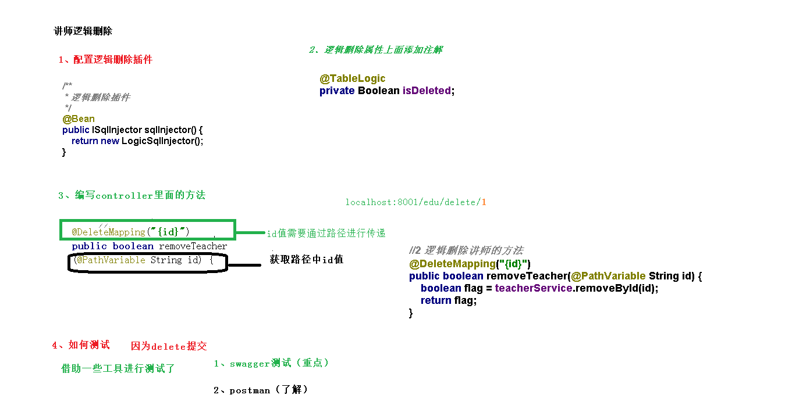
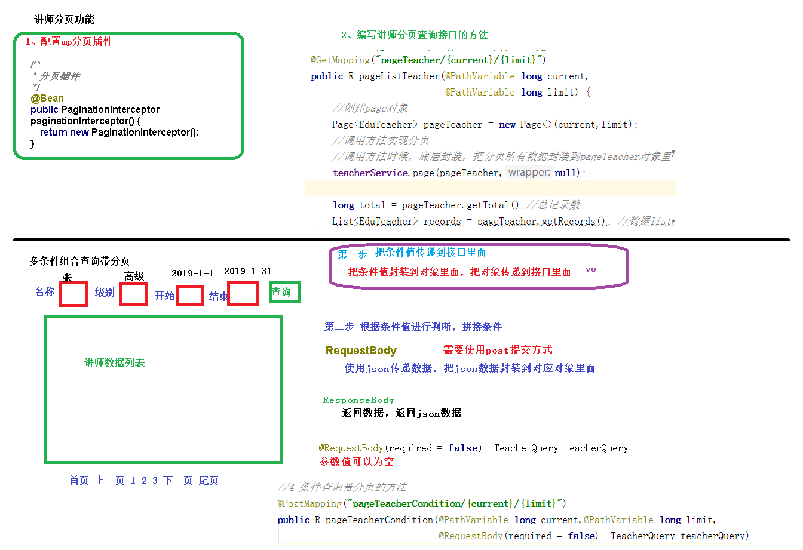
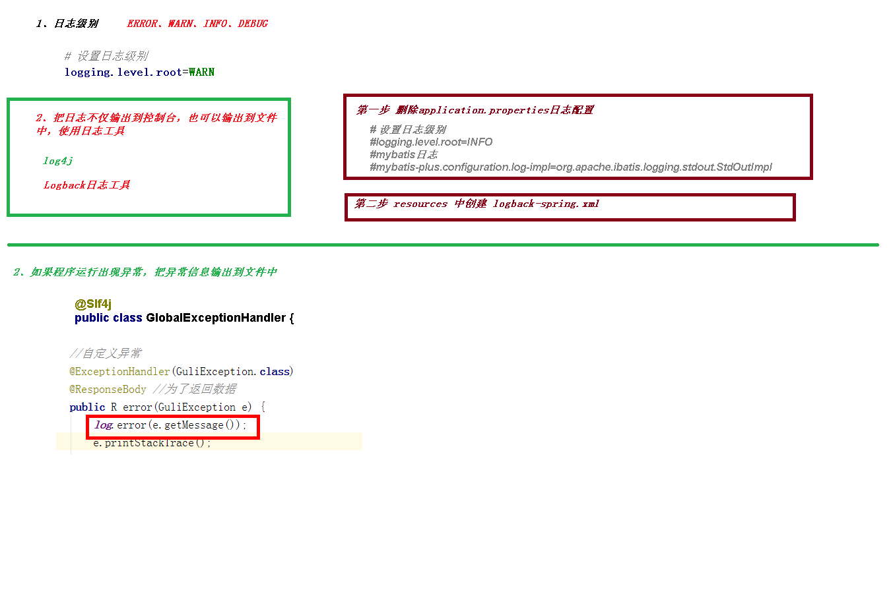

# 项目阶段

## 数据库设计规约

以下规约只针对本模块，更全面的文档参考《阿里巴巴Java开发手册》：五、MySQL数据库

1、库名与应用名称尽量一致


2、表名、字段名必须使用小写字母或数字，禁止出现数字开头，


3、表名不使用复数名词


4、表的命名最好是加上“业务名称_表的作用”。如，edu_teacher


5、表必备三字段：id, gmt_create, gmt_modified（gmt格林尼治时间）

说明：

其中 id 必为主键，类型为 bigint unsigned、单表时自增、步长为 1。

（如果使用分库分表集群部署，则id类型为verchar，非自增，业务中使用分布式id生成器）

gmt_create, gmt_modified 的类型均为 datetime 类型，前者现在时表示主动创建，后者过去分词表示被 动更新。

 

6、单表行数超过 500 万行或者单表容量超过 2GB，才推荐进行分库分表。 说明：如果预计三年后的数据量根本达不到这个级别，请不要在创建表时就分库分表。 


7、表达是与否概念的字段，必须使用 is_xxx 的方式命名，数据类型是 unsigned tinyint （1 表示是，0 表示否）。 

说明：任何字段如果为非负数，必须是 unsigned。 

注意：POJO 类中的任何布尔类型的变量，都不要加 is 前缀。数据库表示是与否的值，使用 tinyint 类型，坚持 is_xxx 的 命名方式是为了明确其取值含义与取值范围。 

正例：表达逻辑删除的字段名 is_deleted，1 表示删除，0 表示未删除。 


8、小数类型为 decimal，禁止使用 float 和 double。 说明：float 和 double 在存储的时候，存在精度损失的问题，很可能在值的比较时，得到不 正确的结果。如果存储的数据范围超过 decimal 的范围，建议将数据拆成整数和小数分开存储。


9、如果存储的字符串长度几乎相等，使用 char 定长字符串类型。 


10、varchar 是可变长字符串，不预先分配存储空间，长度不要超过 5000，如果存储长度大于此值，定义字段类型为 text，独立出来一张表，用主键来对应，避免影响其它字段索 引效率。


11、唯一索引名为 uk_字段名；普通索引名则为 idx_字段名。

说明：uk_ 即 unique key；idx_ 即 index 的简称


12、不得使用外键与级联，一切外键概念必须在应用层解决。外键与级联更新适用于单机低并发，不适合分布式、高并发集群；级联更新是强阻塞，存在数据库更新风暴的风险；外键影响数据库的插入速度。 

#  

## [maven构建的传统web项目与springboot项目](https://www.jianshu.com/p/20233639ac74?utm_source=desktop&utm_medium=timeline)

## 创建父工程

1. 修改spring boot的版本号为2.2.1.RELEASE
2. 在gav下添加\<packaging\>pom\<packaging\>标记为父工程
3. 添加 \<properties\>确定依赖的版本
4. 配置 \<dependencyManagement\> 锁定依赖的版本

## 代码生成器

```xml
<!-- velocity 模板引擎, Mybatis Plus 代码生成器需要 -->

<dependency>

    <groupId>org.apache.velocity</groupId>

    <artifactId>velocity-engine-core</artifactId>

</dependency>
```

~~~java
public class CodeGenerator {

    @Test
    public void run() {

        // 1、创建代码生成器
        AutoGenerator mpg = new AutoGenerator();

        // 2、全局配置
        GlobalConfig gc = new GlobalConfig();
        String projectPath = System.getProperty("user.dir");
        gc.setOutputDir("E:\\developer\\workspace_college\\guli_parent\\service\\service_edu" + "/src/main/java");//使用绝对路径

        gc.setAuthor("testjava");
        gc.setOpen(false); //生成后是否打开资源管理器
        gc.setFileOverride(false); //重新生成时文件是否覆盖
        gc.setServiceName("%sService");	//去掉Service接口的首字母I
        gc.setIdType(IdType.ID_WORKER_STR); //主键策略
        gc.setDateType(DateType.ONLY_DATE);//定义生成的实体类中日期类型
        gc.setSwagger2(true);//开启Swagger2模式

        mpg.setGlobalConfig(gc);

        // 3、数据源配置
        DataSourceConfig dsc = new DataSourceConfig();
        dsc.setUrl("jdbc:mysql://localhost:3306/guli_210131?serverTimezone=GMT%2B8");
        dsc.setDriverName("com.mysql.cj.jdbc.Driver");
        dsc.setUsername("root");
        dsc.setPassword("");
        dsc.setDbType(DbType.MYSQL);
        mpg.setDataSource(dsc);

        // 4、包配置
        PackageConfig pc = new PackageConfig();
        pc.setModuleName("eduservice"); //模块名
        pc.setParent("com.atguigu");
        pc.setController("controller");
        pc.setEntity("entity");
        pc.setService("service");
        pc.setMapper("mapper");
        mpg.setPackageInfo(pc);

        // 5、策略配置
        StrategyConfig strategy = new StrategyConfig();
        strategy.setInclude("edu_subject");//数据库对应的表
        strategy.setNaming(NamingStrategy.underline_to_camel);//数据库表映射到实体的命名策略
        strategy.setTablePrefix(pc.getModuleName() + "_"); //生成实体时去掉表前缀

        strategy.setColumnNaming(NamingStrategy.underline_to_camel);//数据库表字段映射到实体的命名策略
        strategy.setEntityLombokModel(true); // lombok 模型 @Accessors(chain = true) setter链式操作

        strategy.setRestControllerStyle(true); //restful api风格控制器
        strategy.setControllerMappingHyphenStyle(true); //url中驼峰转连字符

        mpg.setStrategy(strategy);


        // 6、执行
        mpg.execute();
    }
}
~~~

## 查询所有讲师


@getMapping中findAll前的/可写可不写，但是@RequestMapping中必须写

### 统一返回的json时间格式

默认情况下json时间格式带有时区，并且是世界标准时间，和我们的时间差了八个小时

在application.properties中设置

 

```properties
#返回json的全局时间格式
spring.jackson.date-format=yyyy-MM-dd HH:mm:ss
spring.jackson.time-zone=GMT+8
```

## 逻辑删除



## swagger

~~~xml
<!--swagger-->
        <dependency>
            <groupId>io.springfox</groupId>
            <artifactId>springfox-swagger2</artifactId>
            <scope>provided </scope>
        </dependency>
        <dependency>
            <groupId>io.springfox</groupId>
            <artifactId>springfox-swagger-ui</artifactId>
            <scope>provided </scope>
        </dependency>
~~~


配置类

~~~Java
@Configuration
@EnableSwagger2
public class SwaggerConfig {

    @Bean
    public Docket webApiConfig(){

        return new Docket(DocumentationType.SWAGGER_2)
                .groupName("webApi")
                .apiInfo(webApiInfo())
                .select()
                .paths(Predicates.not(PathSelectors.regex("/admin/.*")))
                .paths(Predicates.not(PathSelectors.regex("/error.*")))
                .build();

    }
    
    private ApiInfo webApiInfo(){

        return new ApiInfoBuilder()
                .title("网站-课程中心API文档")
                .description("本文档描述了课程中心微服务接口定义")
                .version("1.0")
                .contact(new Contact("Helen", "http://atguigu.com", "55317332@qq.com"))
                .build();
    }
}
~~~

使用

1. 在要用的模块中引入dependency依赖
2. 在模块启动类上组件扫描中加上Swagger的配置类Configuration，启动类默认是只扫描当前模块的

## 统一结果返回


~~~Java
//统一返回结果
@Data
public class R {
    @ApiModelProperty(value = "是否成功")
    private Boolean success;

    @ApiModelProperty(value = "返回码")
    private Integer code;

    @ApiModelProperty(value = "返回消息")
    private String message;

    @ApiModelProperty(value = "返回数据")
    private Map<String,Object> data = new HashMap<String, Object>();

    //把构造方法私有，外面不能直接调用无参构造
    private R(){};

    //成功静态方法
    public static R ok() {
        R r = new R();
        r.setSuccess(true);
        r.setCode(ResultCode.SUCCESS);
        r.setMessage("成功");
        return r;
    }

    //失败静态方法
    public static R error() {
        R r = new R();
        r.setCode(ResultCode.ERROR);
        r.setSuccess(false);
        r.setMessage("失败");
        return r;
    }
    //return this方便链式编程

    public R code(Integer code) {
        this.setCode(code);
        return this;
    }

    public R message(String message) {
        this.setMessage(message);
        return this;
    }

    public R success(Boolean success) {
        this.setSuccess(success);
        return  this;
    }

    public R data(String key,Object value) {
        this.data.put(key,value);
        return this;
    }

    public R data(Map<String,Object> map) {
        this.setData(map);
        return this;
    }
}

~~~

@[ResponseBody](https://www.cnblogs.com/tyadmin/p/11241007.html)根据一个实体类的属性和其对应的值返回一个json

## 分页

~~~Java
    /**
     * 分页查询讲师
     * current  当前页
     * limit 每页记录数
     */
    @GetMapping("pageTeacher/{current}/{limit}")
    public R pageListTeacher(@PathVariable long current,
                             @PathVariable long  limit) {
        //创建page对象
        Page<EduTeacher> pageTeacher = new Page<>(current, limit);
        eduTeacherService.page(pageTeacher, null);//调用方法的时候，底层封装，把分页所有数据封装到pageTeacher对象里面
        long total = pageTeacher.getTotal();


        List<EduTeacher> records = pageTeacher.getRecords();
        Map<String,Object> map = new HashMap<>();
        map.put("total", total);
        map.put("rows",records);

        return R.ok().data(map);

    }
~~~



VO:value object值对象。通常用于业务层之间的数据传递，和PO一样也是仅仅包含数据而已。但应是抽象出的业务对象,可以和表对应,也可以不,这根据业务的需要.

~~~Java
//4条件查询带分页功能

    @PostMapping("pageTeacherCondition/{current}/{limit}")//使用了@RequestBody就要用post提交
    public R pageTeacherCondition(@PathVariable long current,
                                  @PathVariable long limit,
                                  @RequestBody(required = false) TeacherQuery teacherQuery) {
        //创建page对象
        //参数一是当前页，参数二是每页个数
        Page<EduTeacher> page = new Page<>(current, limit);
        //构造条件
        QueryWrapper<EduTeacher> wrapper = new QueryWrapper<>();

        String begin = teacherQuery.getBegin();
        String end = teacherQuery.getEnd();
        Integer level = teacherQuery.getLevel();
        String name = teacherQuery.getName();

        if(!StringUtils.isEmpty(name)) {//spring自带的查询空
            //第一个参数为数据库中的字段名
            wrapper.like("name", name);
        }
        if(!StringUtils.isEmpty(level) ) {
            wrapper.eq("level",level);
        }

        if(!StringUtils.isEmpty(begin)){
            wrapper.ge("gmt_create",begin);//数据库中的字段名，而自动填充的是类中的属性名
        }
        //基于创建时间来查询
        if(!StringUtils.isEmpty(end)){
            wrapper.le("gmt_create",end);
        }
        //排序
        wrapper.orderByDesc("gmt_create");

        //调用方法实现分页查询
        eduTeacherService.page(page,wrapper);
        long total = page.getTotal();
        List<EduTeacher> records = page.getRecords();
        Map<String,Object> map = new HashMap<>();
        map.put("total",total);
        map.put("rows", records);
        return R.ok().data(map);

    }
~~~

使用@RequestBody(required = false)后


未使用


面试的时候说@PathVariable，@RequestBody

## 添加讲师

~~~java
  //添加讲师接口的方法
    @PostMapping("addTeacher")
    public R addTeacher(@RequestBody(required = false) EduTeacher eduTeacher) {
        boolean save = eduTeacherService.save(eduTeacher);
        return save ? R.ok() : R.error();
    }
~~~


## 修改讲师


~~~java
@PostMapping("updateTeacher")
    public R updateTeacher(@RequestBody(required = false) EduTeacher eduTeacher) {
        boolean b = eduTeacherService.updateById(eduTeacher);
        return b ? R.ok():R.error();
    }
~~~

## 统一异常处理

~~~Java
/**
 * 统一异常处理类
 */
@ControllerAdvice//标志全局异常处理
public class GlobalExceptionHandler {

	   //指定出现什么异常执行这个方法
    @ExceptionHandler(Exception.class)
    @ResponseBody//为了返回数据
    public R error(Exception e) {
        e.printStackTrace();
        return R.error().message("执行了全局异常处理");
    }
	}
}
~~~


设置后


一般的自定义异常，用@AllArgsConstructor  @NoArgsConstructor可自动生成有参，无参构造

~~~Java
/**
 * 自定义异常类
 * 用户不存在异常信息类
 */
public class UserNotExistsException extends RuntimeException{
 
    public UserNotExistsException() {
        super();
    }
    public UserNotExistsException(String message) {
        super(message);
    }
}
~~~

~~~java
@Data
@AllArgsConstructor
@NoArgsConstructor
public class GuliException extends RuntimeException {
    private Integer code;
    private String msg;
}
//这里有参构造就是
public GuliException(Integer code，String msg) {
        this.code = code;
    	this.msg = msg
    }
所以直接new GuliException(20001,"自定义异常")
~~~

## 统一日志处理



logback可以让日志既输出到控制台又输出到文件中去

把error和warn信息输出到本地文件中要配合slf4j